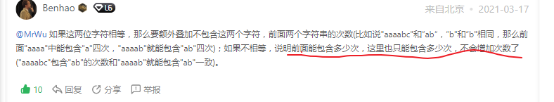

# 力扣疑难点

## 代码随想录

### 数组

**数组，List，Map，Set之间的相互转换**

```java
int[] re = ...
List<> res = 
//转换成List
    Arrays.asList(re);//不能修改结构只能查找
	new ArrayList<>(Arrays.asList)//这种的都可以
        
//List转换成数组
    res.toArray()//不推荐，转换成Object类型
    res.toArray(new int[])// 推荐
//List --> set
        addAll
        目的去重
//set --> List
        addAll
        目的排序
```

### LinkedList 和ArrayList

```java
ArrayList：
    add()											增加一个元素
    add(index,e)									在指定位置增加元素
    addAll()										增加一组元素
    remove(index)或者remove("知道的值")
    
    for(int i = 0;i < Arraylist.size();i++){		遍历
        System.out.pringln(ArrayList.get(i))
    }
	
	ArrayList.toArray();
	ArrayList.toArray(new String[]{})				转数组
    
    list.isEmpty()
    list.contains("1")								是否包含"1"
    list.subList(0,3)								截取0-3的位置
    list.indexOf("1")								"1"的索引位置
        
```

```java
LinkedList:
	addFirst()			在链表开头增加元素
    addLast()			在链表结尾增加元素
    offer()				将指定元素增加到链表的结尾
    removeFirst()		删除链表的第一个元素
    removeLast()		删除链表的最后一个元素
    
```

### Queue

```java
offer()			指定元素加到链表的结尾
peek()			找到但不删除链表的头
poll()			找到并删除链表的头
remove()		检索并移除表头
```


### Map

```java
//添加操作
map.put(key,value);
//删除操作
map.remove(key);

//查询操作
map.containsKey(key);
map.get(key);

//修改  key1替换为key2
map.replace(key1,key2);

//遍历所有的key
Set set = map.keySet()
for(Object obj:set){
}

//遍历所有的value
map.values();

//遍历键值对
map.entrySet();

//初始化键值对
Map<Character,Integer> map = new HashMap<>(){
    {
        put('a',1);
        put('b',2);
    }
}

//Map.getOrDefault(key,默认值)

Map中会存储一一对应的key和value。
如果 在Map中存在key，则返回key所对应的的value。
如果 在Map中不存在key，则返回默认值。
    
//返回键值对的数量,也可以判断map是否为空
    
map.size()

//从0开始的for循环，map添加出现元素的次数
for(int i = 0;i < nums.length;i++){
    map.put(nums[i],map.getOrDefault(nums[i],0) + 1);
}
```

### 堆跟优先队列

```java
//堆		完全二叉树   按照层序遍历的方式用一维数组表示
//在一维数组中，父节点为i  左节点2i+1	  右节点2i+2


//新建一个优先级队列，小根堆；将键值对加入到优先级队列中；
//存储的是一个数组，里面放(key,value)
//(pair1,pair2)->pair1[1]-pair2[1] 定义的比较器；默认是升序排列的；下面的有比较器的举例；
PriorityQueue<int[]> que = new PriorityQueue<>((pair1,pair2)->pair1[1]-pair2[1]); //加入的是键值对；
PriorityQueue<int[]> que = new PriorityQueue<>((pair1,pair2)->pair2[1]-pair1[1]); //按照降序排列

返回前k个高频元素
PriorityQueue<int[]> que = new PriorityQueue<>((pair1,pair2)->pair2[1]-pair1[1]);
//遍历map
for(map.Entry(Integer,Integer) entry:map.entrySet()){
    que.add(new int[]{entry.getKey,entry.getValue});
}
int[] ans = new int[k];
for(int i = 0;i < k;i++){
    ans[i] = que.poll()[0];
}
return ans;
```

#### KMP算法

```java
主要是求next数组
//例如	“google”
```

#### String与Int转换

```java
//字符串转数字；包装类parseXXX()
String str = "456";
int a = Integer.parseInt(str)   456
int b = Integer.parseDouble(str)  456.0
    
int c = str.charAt(0) - '0'   4
    
//数字转为字符串
Integer a1 = 123;
int a2 = 456;

//首选既可以用于包装类又可以用于基本数据类型
String str = String.valueOf(a1);

String str = a1 + "";

//toString()只能用于包装类
String  srt = a1.toString(); "123"

```


##### **1.移除元素**：

​		快慢指针。条件不等于val，用快指针覆盖慢指针。

##### **2.长度最小的子数组**：

```java
//滑动窗口模板
for(){
    while(){
        .....
    }
}
```

​		1.一个for循环嵌套一个while，自增加和，while条件是大于target之后，开始移动窗口

​		2.不需要排序。

##### **3.螺旋矩阵**：（给定一个数n，返回n*n矩阵）

​		1.while循环体中是loop++ < n / 2；for循环中的终止条件是j < n -loop;

### 链表

##### **1.移除链表元素**：

​		1.首先设置头指针

​		2.设置pre跟cur，永远记住pre跟cur只是两个指针。

##### **2.设计链表**：

​		1.查找指定index的元素时，通过：

```java
for(int i = 0;i <= index;i++){
    cur = cur.next;
}
```

​		2.并且涉及到查找等，都要设置 ListNode cur = head;

​		3.双向链表的添加：先1,3再2,4。先确定好添加节点的前后指针。


****

**3.反转链表**

​		1.涉及到交换元素，必须要设置一个临时变量temp=null；

​		2.将设置一个空链表pre=null，然后将head链表取出头一个节点加入pre，最后返回pre。

**4.两两交换链表中的元素**：

​		1.主要找到最后两个元素，然后进行递归交换

```java
(条件)
ListNode next = head.next;
ListNode temp = swap(next.next);
```

**5.删除倒数第n个节点的值**

​		1.设置快慢指针，利用快慢之间的差等于n来判断，当快指针走到链表结束的时候，慢指针所在的位置就是要删除的倒数第n个节点

​		2.设置头结点。

**6.链表相交**	

​		1.短的链表一直走，走到头再去走长的，长的再走，走到头在走短的，这样两者有共同节点必定会相遇，没有共同节点的话也必定会			同时指向null

```java
//赋值语句，先是pA == null ? headB:pA.next，之后才是赋值给pA。
pA = pA == null ? headB:pA.next;
```

### 哈希表

**1.快乐数**

​		1.设置一个HashSet集合，防止计算之后还是n陷入死循环。

​		2.声明一个计算的方法。

**2.四数之和**：

​		1.用一个Map就够，存放数字和出现和的次数。

### 字符串

**1.找出第一个匹配的下标**

​		1.可以用定义好的接口

```java
return 寻找.indexOf(被寻找)
```

**2.反转字符串中的单词**

​		1.如果是包含空格的String，去反转每个单词,如何去找到空格之前的单词

```java
int start = 0
end = start + 1;
while(start < end){
	while(start < end && end != ' ');
		end++;
}
```

### 二叉树

​	1.**如果递归逻辑汇中传入的是左右子树，例如root.left/root.right，那么递归的终止条件来判断root即可。**

​	2.**前序求深度，后续求高度**

​	3.**如果判断条件中有root == null，紧挨着下面的判断条件中还有root.left == null 或者root.right == null,说明节点就走到root   			（路径总和）。**

##### **1.反转二叉树**：

​		1.设计一个用来反转树的方法。

##### **2.对称二叉树**

​		1.判断左子树的左节点和右子树的右节点。

​		2.判断左子树的右节点和右子树的左节点。

##### **3.最小深度**

```java
//比最大深度多了两个if判断条件
if(root.left == null) return rightDepth+1;
if(root.right == null) return leftDepth + 1;
return Math.min(leftDepth,rightDepth) + 1;
```

##### **4.平衡二叉树、最大深度、最小深度、完全二叉树节点个数模板**

```java
if(root == null) return 0;
int left = method(root.left);
//具体逻辑
int right = method(root.right);
//具体逻辑
return Math.max/min(left,right) + 1;
```

##### **5.二叉树的路径遍历**

​		1.中左右

​		2.回溯思想

```java
search()
path.add(root)
if(root.left == null && root.right == null)
   	result.add()
if(root.left != null)
    search();
	path.remove()
if(root.right != null)
    search();
	path.remove()
```

##### **6.左叶子之和**

​		1.重点是如何找到左叶子（左右中，不管怎么先把递归的遍历顺序找出来）

```java
if(root.left != null && root.left.left == null && root.left.right == null)//表示通过父节点找到左叶子节点
```

##### **7.找左叶子节点**

​		1.用层序遍历简单，把之前的层序遍历节点稍作改动，while（len>0)改成for循环，目的是利用i == 0找第一个弹出的值

```java
for(int i = 0;i < len;i++){
    if(i == 0){
        res = temp.val;//不断的更新每一层第一个节点值。
    }
}
```

##### **8.路径总和**

​		1.按照减法，将目标和依次递减走过的节点。

```java
//三种情况
targetSum -= root.val
1.if(root.left == null && root.right == null)
2.if(root.left != null)
3.if(root.right != null)
```

##### **9.合并两个二叉树**

​		1.注意在一个二叉树（root1）上重复操作，最终返回这一棵二叉树即可。

#### 二叉搜索树（中序遍历为有序序列）

##### **1.是否为二叉搜索树**（二插搜索树中的最小绝对差）

​		1.空树也是二叉搜索树。

​		2.双指针解法：重点是怎么去赋值当前节点的前一个节点。

```java
//定义一个TreeNode指针 默认为空
TreeNode pre;
//这里写的是递归函数，刚开始一直递归到左子树的最后一个节点，if第一次不执行，正好将root的值赋给pre
if(pre != null && pre.val >= root.val){
    return false;
}
pre = root;

```

##### **2.平衡二叉树的众数(中序遍历）**

​		1.一个是计数：

```java
//双指针，pre是前一个指针
TreeNode pre;
if(pre == null || pre.val != root.val){//第一次出现的节点和不相等的节点的count次数都是1
    count = 1;
}else(pre.val == root.val){
    count++;
}
```

​		2.计算出现最多的

```java
if(count == maxCount){
    result.add(root.val);
}else if(count > maxCount){
    result.clear();
    result.add(root.val);
    maxCount = count;
}
```

##### **3.二叉树的公共祖先**

​		1.后续遍历（单个节点也是自己的公共祖先）

```java
if(root.left != null && root.right == null) return left;//左子树找到了，右子树没找到，返回该节点
if(root.left == null && root.right != null) return right;//同上
```

##### **4.二插树的修剪，涉及到删除的，条件都是return null**

#### 后序

##### 652.寻找重复的子树

​	

（用到了序列化子树，换句话说，一旦发现题目跟子树有关，那大概率要给函数设置合理的定义和返回值，在后续位置写代码）

```java
//1.	寻找重复的子树，那当前结点的子树长什么样子？其他子树的节点是长什么样子？只有知道这两点，才能判断重复的子树是啥
//2.	如何知道子树长什么样子？需要用什么去保存子树的样子？ 
//3.	序列化子树，用Map来保存，采用后序遍历

String traverse(TreeNode root){
    if(root == null) return "";
    String left = traverse(root.left);
    String right = traverse(root.right);
    //查看子树长啥样子
    String subTree = left + "," + right +"," + root.val;//这个顺序无所谓
    //子树出现的次数
    int freq = map.getOrDefault(subTree,0)
    //为什么是==1就可以呢？因为只要map中有过一次的记录就说明这个节点是重复的，不用管重复几次一定是重复的，直接将root节点加入到结果集就可以了。
 	if(freq == 1){
        //加入的是根节点
        result.add(root);
    }
    map.put(subTree,map.getOrDefault(subTree,0) + 1);
    return subTree;
}

```

#### 序列化

##### 剑指offer37

```java
//1.	什么样的序列化的数据可以反序列化出一棵二叉树？只给定前序遍历结果能行吗？只给定后序遍历结果能行吗？比如[1,2,3,4,5]
//2.	答案是不可以的，因为没有空指针信息，如果包含了空指针信息的话就能够确定一棵二叉树（除了中序遍历），例如将上面改成 [1,2,3,#,#,4,#,#,5,#,#]，或者是不给你空指针信息，给你两种遍历顺序，前序和中序，中序和后续都可以还原二叉树
//3.	题目的返回值是什么？序列化是将树转化成字符串，反序列化是将字符串转化成序列
//4.	该用什么方式去遍历？给你一个数组，你该怎么让他变成含有空节点的字符串

String SEP = ",";	//确定分隔符
String NULL = "#";	//需要定义空节点
void serialize(TreeNode root,StringBuilder sb){
    if(root == null){
        sb.append(NULL).append(SEP);
    }
    sb.append(root.val).append(SEP);
    serialize(root.left，sb);
    serialize(root.right,sb);
     
}

//反序列化
public TreeNode deserialize(String data) {
    LinkedList<String> nodes = new LinkedList<>();
    //二刷的时候，split没搞明白"1,2,3" --> [1,2,3],还有怎么将字符串转为TreeNode形式
    for(String s: data.split(SEP)){
        nodes.addLast(s);
    }
    return deserialize(nodes);
}
//	二刷的时候传入什么样的参数不明白，是将String类型的LinkedList传入进去，新建的为root
TreeNode deserialize(LinkedList<String> nodes){
    if(nodes.isEmpty()) return null;
    String first = nodes.removeFirst();
    if(first.equals(NULL)) return null;
    
    TreeNode root = new TreeNode(Integer.parseInt(first));	//不然字符串不能转成Int；
    //	二刷的时候递归写错了
    root.left = deserialize(nodes);
    root.right = deserialize(nodes);
    return root;
    
}
```


#### 特性篇

##### BST树（二叉搜索树）

二叉搜索树的中序遍历结果是升序

值得注意的是，先左再右的结果是升序的，那么颠倒一下遍历顺序是不是就是降序的？这个一定要注意！！！

##### 538.	把二叉树转化为累加树

​	

```java
//1.	题目的意思，例如节点5，转换后变为 6+7+8 然后在加上5 结果等于26。没问题吧
//2.	头一次刷的时候想到的是既然是二叉搜索树，那么遍历顺序的结果是递增的。右子树的值确实比当前结点值大，可以加上，但是父节点的值呢？父节点的值也比当前节点值大啊？但是没有父节点的指针啊，怎么加呢？
//3.	既然按照先左子树再右子树遍历得到的是升序，那颠倒一下是不是就得到了降序？那这样生命一个临时变量来记录右子树的值最后加到当前节点是不是就满足了？

int sum = 0;

void convert(TreeNode root){
    if(root == null) return;
    convert(root.right);
    sum += root.val;
    //更新节点值
    root.val = sum;
    convert(root.left);
}
```


### 回溯

#### （组合问题：如果结果集中有重复元素，递归条件是i；否则递归条件是i + 1）

**1.电话号码的字母组合**

​		1.首先要定义一个映射的关系。

​		2.不同于普通组合，这是不同集合之间的不同组合

​		3.去看代码

**2.组合求和**（数组中的每一个值在每一个组合中只能使用一次）

​		1.设置boolean类型的used数组来判断之前的是否使用过。

```java
//for循环中的条件
if(i > 0 && nums[i] == nums[i-1] && !used[i])
```

#### 分割问题

**1.分割回文串**

​		1.多了一个判断是否为回文串的过程，不是的话就continue；

**2.ip地址问题**

​		1.设置pointSum，如果  . 的数量等于三，之后在判断最后那一段字符串是否符合要求，符合就加入进去

```java
if(pointSum == 3){
    if(isLegal(s,startIndex,s,length() - 1)){
        result.add(s);
    }
}
```

​		2.逗点的加入；也就是字符串的加入

```java
//字符串是能动态处理，只能截取之后拼接，StringBuilder对象类型的字符串可以动态处理
s = s.substring(0,i + 1) + "." + s.substring(i+1);
```

​		3.求和问题给定字符串的起始节点跟终止节点

```java
int sum = 0;
for(int i = left;i < right;i++){
    sum = sum * 10 +(s.charAt(i) - '0');
}
```

​		4.从字符串charAt出来的数字需要 - '0'才是正常的数字

```java
s = "123456"
System.out.println( (s.charAt(0) - '0') * 10)
    //这样才能输出10
```

#### 子集问题

**1.子集1和子集2**

​		1.子集1不包含重复元素，返回可能的所有子集，解集中不能包含重复元素。

​		2.子集2包含重复元素，返回所有的可能的子集，解集中不能包含重复元素。

```java
对比子集1，子集2的处理方式是首先对数组排序，然后使用used数组。
```

**2.递增子序列**

#### 排列问题（都用不到startIndex）

**1.全排列**

1.不用startIndex来控制不取之前的元素，通过used数组来控制当前元素取过就不再取了。

```java
//注意两个点。一个是没有startIndex，i从0开始的
//另外一个是used数组，标记了就不能再取当前元素了。
for(int i = 0;i < nums.length;i++){
	if(sued[i]){
        continue;
    }
    used[i] = true;
    path.add(nums[i]);
    backtracking(.....);
}
```

### 贪心算法

#### 一般两个变量，一个动态记录最大值，一个用来运算。

**1.分发糖果**

​		1.一个循环条件中控制两个变量

```java
for(int i = 0;i < s.length && start < g.length;i++){
    if(s[i] >= g[start]){
        count++;
        start++;
    }
}
```

**2.摆动序列**

​		1.处理边界序列，所以默认就有一个；即count = 1；

​		2.

```java
if((curDiff > 0 && preDiff <= 0) || (curDiff < 0 && preDiff >=0)){
    count++;
}
```

**3.最大子数组和**

​	1.设置count用于动态的选取初始位置

​	2.如果count <= 0,说明加了一个负数，重置count = 0；（可以加小一点的负数，但是最大值记录的是在没加这个很小的负数的时候的		值）

**4.买卖股票的最佳时机**

​		1.所以只需要将买卖股票的时间转换成每天买卖的利润即可

```java
prices[3] - prices[1] = (prices[3] - prices[2]) + (prices[2] - prices[1])
```

​		2.只记录利润为正的和

**5.跳跃游戏**

​		1.确保覆盖范围能够大于数组的长度即可，在第一个位置的时候 >= nums.length - 1 即可

​		2.不断的更新覆盖范围

```java
for(int i = 0; i< coverRange;i++){
    coverRange = Math.max(coverRange,i + nums[i]);//i + nums[i]的i表示之前已经跳过的步子；
}
```

**6.跳跃游戏II**

​		1.每次在上次能跳到的范围（end）内选择一个能跳的最远的位置（也就是能跳到max_far位置的点）作为下次的起跳点 。

```java
int end = 0;//作为能够跳跃达到的右边界；
int maxPosition = 0;//最为能够跳到的最远的位置
int step;
for(int i = 0;i < nums.length - 1;i++){
    maxPosition = Math.max(maxPosition,i + nums[i]);//找覆盖到的跳跃范围内的最大值；
    if(i == end){//i 走到了i下标对应的覆盖最远位置后；
		end = maxPostion;
        step++;
    }
}
```

**7.加油站**

​	1.计算出总的耗油量，如果是负数，无论如何都不可能走完全称；

​	2.计算每一段路程最小的耗油量

```java
minGas = Math.min(sumGas,minGas)
```

​	如果说最小的耗油量都大于0的话，那么for循环从i = 0开始的，即0号加油站就符合要求

​	3.如果不是的话，那么倒叙循环，不断的计算每一个加油站与最小油耗的和，当把最小油耗变成>=0的时候，遍历到的i就是起始位置。

**8.根据身高重建队列**

**9.射爆气球**

**Arrays.sort重写**

```java
[[1,2],[3,4],[3,5]]
Arrays.sort(person,(a,b) ->{
    return a[0] - b[0];
})
// a - b 表示升序；
// b - a 表示降序；
```

**10.无重叠区间**

​		1.从左到右去遍历，首先按照[a,b]中的b对集合进行从小到大的排序

​		2.初始化右边界为最小值，处理集合中第一个区间

​		3.若上一个区间的右边界小于当前区间的左边界说明没有重叠部分；更新边界

```java
edge = nums[i][1]
```

```java
else{
    count++;
}
```

**11.划分字母区间**

​		1.确定每一个元素出现的最远位置。

​		2.重新遍历字符串，不断更迭出现的最远距离，如果最远距离刚好与遍历的下标i相等。此时做分割。

**12.单调递增的数字**

​		1.需要start确定从哪个位置开始赋值9；

​		2.包括将数字转化成字符串等。

**13.买卖股票的最佳时机含手续费**

### 动态规划

#### 动归五部曲-基础

```java
//	1.确定dp数组下标及其含义
//	2.确定递推公式
//	3.dp数组如何初始化
//	4.确定遍历顺序
```

#### 什么时候用动态规划？

```java
//1.	一般具有最优子结构，能够从局部最优推出全局最优
//2.	一般最值题，用到的就是动态规划
```

#### 数组的初始化

```java
//1.	为什么有的要初始话成dp[n+1]或者dp[n+1][m+1]而不是dp[n][m]呢？
//2.	一般来说，如果递推公式中要用到 i-1 等类似的判断，就要用到偏移量，因为索引不能为-1。 当然这种情况也不是绝对的，大部分来说是的，具体还要具体情况具体分析
```

#### dp数组的遍历方式

```java
//1.	正向遍历
int[][] dp = new int[m][n];
for (int i = 0; i < m; i++){
    for (int j = 0; j < n; j++)
        // 计算 dp[i][j]
}
        
//2.	反向遍历
for (int i = m - 1; i >= 0; i--){
    for (int j = n - 1; j >= 0; j--)
        // 计算 dp[i][j]
}


//3.	斜着遍历
for (int l = 2; l <= n; l++) {
    for (int i = 0; i <= n - l; i++) {
        int j = l + i - 1;
        // 计算 dp[i][j]
    }
}
  
```


##### **1.最小花费爬楼梯**

​		1.dp数组的长度是length + 1，+1代表走到楼顶。

##### **2.整数拆分**

​		1.拆成相似的数的时候乘积最大（数学证明）

##### **3.不同的二插搜索树**

​		1.给定一个数字n，确定搜索树个数

​		2.dp[i] 对应的是i个节点的搜索树个数有多少

​		3.以j为头结点，遍历i

```java
dp[0] = 1,dp[1] = 1;
for(int i = 2;i <= n;i++){
    //j代表从1-i个数中选取的不同的数当头结点，=的时候表示右子树是空的情况
    for(int j = 1;j <= i;j++){
        //j-1因为搜索树左子树都比头结点小，i-j代表右子树，因为右子树节点值都比头结点大
        dp[i] += dp[j-1]*dp[i-j];
    }
}
```

#### 0-1背包问题


**1.0-1背包就是有n中物品，每种物品只有一个**

**2.完全背包是有n中物品，每种物品有无数个**

**3.多重背包是有n种物品，每种物品个数各不相同**

```java
//初始化问题
//递推公式及遍历顺序
for(int i = 1;i <= weight.length;i++){
    for(int j = 1;j <= bagSize;j++){
        if(j < weight[i-1]){
            dp[i][j] = dp[i-1][j];
        }else{
            dp[i][j] = Math.max(dp[i-1][j],dp[i-1][j-weight[i-1] + value[i]]);
        }
    }
}
```

**1.最后一块石头的重量**

​		1.将石头总和分成两堆，其中一堆作为背包，石头的重量跟价值都是数组中元素，求dp[j]

```java
//最终结果
result = sum - dp[target] - [target]
```

**2.目标和**

​		1.给定nums[]和target；

​		2.数组里肯定有两部分left - right = target；还有一部分是固定的 left+right = sum；整理得到left = （sum + target) / 2;

​			所以题意可以理解为，给定一个left背包，有多少种组合方式能将该背包装满。

​		3.装满背包方式的递推公式为 dp[j] = dp[j-nums[i]]；所以总的方式有dp[j] += dp[j-nums[i]]; 

**1和0**

#### 完全背包问题

```java
//与0-1背包的区别
0-1：
for(int i = 0;i < weight.length;i++){
    for(int j = bagSize;j >= weight[i];j--){
        dp[j] = Math.max(dp[j],dp[j-weight[i]] + value[i]);
    }
}
//完全背包
for(int i = 0;i < weight.length;i++){
    for(int j = weight[i];j <= bagSize;j++){
        dp[i] = Math.max(dp[j],dp[j-weight[i]] + value[i]);
    }
}
//应用方面求背包最大价值
dp[j] = Math.max(dp[j],dp[j-weight[i]] + value[i]);
//应用方面求装满背包有多少中方法
dp[j] += dp[j-weight[i]];

```

#### 买卖股票问题：

**1.买卖股票的最佳时机(只允许一次交易）**

​		1.股票问题初始化dp数组为二维状态（持有股票、不持有股票）

```java
int[][] dp = new int[len][2];
//持有股票:dp[i-1][0]是指前一天也可能持有，今天没买入而已，另外一种情况是前一天没有，当天买入，花掉了prices[i]
dp[i][0] = Math.max(dp[i-1][0],-prices[i]);
//不持有股票:
dp[i][1] = Math.max(dp[i-1][1],dp[i-1][0] + prices[i]);
```

**2.买卖股票的最佳时机（允许多次交易）**

​		1.与上面唯一的不同点是

```java
//持有股票
dp[i][0] = Math.max(dp[i-1][0],dp[i-1][1] - prices[i]);
```

**3.买卖股票的最佳时机（至多允许两次交易）**

**4.买卖股票的最佳时机IV**

**5.买卖股票的最佳时机含冷冻期**

**6.买卖股票的最佳时机含手续费**

```java
//初始化
dp[0][0] = -prices[i]
//递推公式
dp[i][0] = Math.max(dp[i-1][0],dp[i-1][1] - prices[i]);
dp[i][1] = Math.max(dp[i-1][1],dp[i-1][0] + prices - fee);
```


#### 子序列问题

##### 300	最长递增子序列

​	

```java
//1.	dp[i] 代表 以当前位置结尾的最长子序列长度
//2.	转移方程是什么？？		位置i的最长递增子序列为0到i-1的最长上升子序列 + 1；
//3.	那怎么去找0 到 i-1 的最长上升子序列呢？？	再遍历一遍。
//4.	最终的结果是啥呢？	dp[num.length]？ 绝对不是，dp[i]代表的含义是以nums[i]为结尾的最长子序列长度，所以我们的结果是找dp数组中的最大值。

for(int i = 0;i < nums.length;i++){
    for(int j = 0;j < i;j++){
        if(nums[i] > nums[j]){
            //dp[i] 是第二遍遍历的时候不断地变化的，一直变到最大值
            dp[i] = Math.max(dp[i],dp[j] + 1);
        }
    }
}
//遍历找到最大值


int res = 0;
for(int i = 0;i < dp.length;i++){
    res = res > dp[i]?res:dp[i];
}
return res;
```

##### 115.	不同的子序列

​	

​	

​	第二种理解

​	

```java

//1.	刚开始想的是背包问题，不明白的是怎么取？用什么方式装满，因为字符串不能加减。所以这明显不是背包问题，背包问题适合数字。
//2.	既然不是背包问题，那就是定义dp[][],dp[i][j]的含义是什么？
//3.	dp[i][j]代表前i个字符串可以由j个字符串组成的个数。
//4.	动态转移方程是什么？如果遍历s.charAt(i-1) != t.charAt(j-1) 那最多的次数是dp[i-1][j],即i之前能包含多少次，这里也只能包含多少次
//		那如果相等的话是什么情况？ 分为 i 这个字符串可以取也可以不取，dp[i-1][j-1] + dp[i-1][j]，那如果取的话就是跟之前i-1，j-1结尾的字符串的子序列个数一致，注意是个数。那如果不取的话，就跟i-1，j结尾的子序列个数一致。为什么相等的时候有取或者不取这两种情况呢？就好像我们逛街一样，我们遇到了自己的目标店铺的时候会有两种选择，一种是就它了进去买买买，另一种选择是再往前走走，说不定前面还有 但是如果我们始终没有遇到想看的店铺的时候，就必须往前走，只有这一种选择。

题解链接：https://leetcode.cn/problems/distinct-subsequences/solution/115-bu-tong-de-zi-xu-lie-by-shen-du-rm-18kr/


for(int i = 1;i <= m;i++){
    for(int j = 1;i <= n;j++){
        if(s.charAt(i-1) == t.charAt(j-1)){
            dp[i][j] = dp[i-1][j-1] + dp[i-1][j];
        }else{
            dp[i][j] = dp[i-1][j];
        }
    }
}
```

其实上面的解法就是0-1背包问题，没有用滚动数组，就是取第i个字符跟不取第i个字符的情况，s为物品，t为背包。下面这个是用了滚动数组做优化

```java
//方法2：
//1.	前面说不能背包问题，打脸了，其实是可以背包问题的，只是编码能力弱，不懂融会贯通
```

​	

##### **2.最长重复子数组、最长公共子序列(不相交的线）**

​		1.最长重复子数组，数组元素之间必须相连，找到最长的公共部分，如：[1,2,3,2,1]和[3,2,1,4,7]公共部分 **[3,2,1]**

​		2.最长公共子序列，元素之间可以不必相连，找出最长的公共部分，如："a,b,c,d,e"和"a,c,e"公共部分 **a,c,e**

```java
//1.递推公式
if(nums[i-1] == nums[j-1]){
    dp[i][j] = dp[i-1][j-1] + 1;
}
//2.递推公式
if(ch[i-1] == ch[j-1]){
    dp[i][j] = dp[i-1][j-1] + 1;
}
else{
    dp[i][j] = Math.max(dp[i-1][j],dp[i][j-1]);
}
```

##### **3.判断子序列**

​		1.跟求最长公共子序列套路一样，但是在s[i-1] != t[j-1]的时候，因为t字符串的长度是大于s的，所以t要删除当前的t[i-1]

```java
如果删除t[t-1],则dp[i][j] 就要由dp[i-1] 和 dp[j-2]决定。即dp[i][j] = d[i][j-1]
if(s[i-1] == t[i-1]){
    dp[i][j] = dp[i-1][j-1] + 1;
}else{
    dp[i][j] = dp[i][j-1];
}
//最后遍历dp数组找出最长子序列的值看看是否与s.length()相等；
```

##### **4.不同的子序列**

##### **5.两个字符串的删除操作**

##### **6.字符串中有多少个回文子串**

```java
for(int i = len -1;i >= 0;i--){
    for(int j = i;j < len;j++){
        if(str[i] == str[j]){
            if(j -i >= 1){
                dp[i][j] = true;
                count++;
            }else if(dp[i+1][j-1]{
             	dp[i][j] = true;
                count++;
            }
        }
    }
}
```


#### 7.编辑距离

​	

```java
//1.	左上角三个值分别对应什么操作？  [i-1][j-1]:替换，[i-1][j] 删除 [i][j-1] 增加

//2.	dp[i][j] 含义？ 以下表[i-1]结尾的字符串s1,和以下表[j-1]为结尾的字符串，最近编辑距离为dp[i-1][j-1]
//		这就要求我们从1开始遍历，

//3.	dp初始化为多少？dp[0][j] = j; 空字符串变成j个字符的字符串需要添加j次操作，同理dp[i][0] = i，需要进行i次增加操作

//4.	递推公式
for(int i = 1;i <= m;i++){
    for(int j = 1;j <= n;j++){
        if(s1.charAt(i-1) == s2.charAt(j-1)){
            dp[i][j] = dp[i-1][j-1];
        }else{
            dp[i][j] = Math.min(Math.min(dp[i-1][j],dp[i][j-1]),dp[i-1][j-1]) + 1;
        }
    }
}
return dp[m][n];
```

