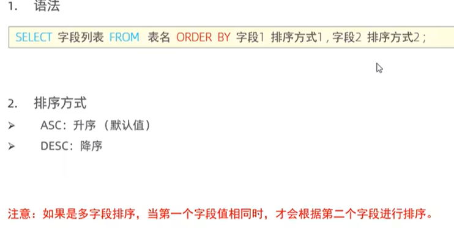

## SQL分类

**DDL**：数据定义语言

**DML**：数据操作语言

**DQL**：数据查询语言

**DCL**：数据控制语言

## DDL   []表示可有可无


```sql
#添加数据
INSERT INTO 表名(字段1，字段2..) VALUES(值1，值2..);
#修改数据
UPDATE 表明 SET 字段1=值1 [WHERE 条件]；
#删除数据
DELETE FROM 表名 [WHERE 条件]
```

## DQL


**基础查询**

```sql
#查询员工地址并起别名
SELECT workaddress as'工作地址' FROM emp;

#查询员工地址不要重复（distinct)
SELECT distinct workaddress as'工作地址' FROM emp;


```

**条件查询**


```sql
#查询年龄等于80的员工
SELECT name FROM emp WHERE age=80;

#查询年龄小于20的员工
SELECT * FROM emp WHERE age < 20;

#查询没有身份证号的员工
SELECT * FROM emp WHERE id IS NULL;

#查询有身份证号的员工
SELECT * FROM emp WHERE if IS NOT NULL;

#查询年龄在15（包含15）到20岁之间的员工
SELECT * FROM emp WHERE age BETWEEN 15 AND 20;

#查询性别为女且年龄小于20的员工信息
SELECT * FROM emp WHERE SEX='女' AND age < 20;

#查询姓名为两个字(两个下划线）的员工信息
SELECT * FROM emp WHERE name LIKE '__';

#查询身份证号码最后以为是X的员工
SELECT * FROM emp WHERE id LIKE '%X';
```

**聚合函数**

count、max、min、avg、sum、

```
SELECT [COUNT()、MAX()、MIN()、AVG()、SUM()]FROM emp;
```

**分组查询**

通常配合聚合函数来操作


```sql
#根据性别分组，统计男性和女性的数量
SELECT gender,COUNT(*) FROM emp GROUP BY gender;

#根据性别分组，统计男性和女性的平均年龄
SELECT gender,avg(age) FROM emp GROUP BY gender;

#查询年龄小于45的员工，并根据工作地址分组，获取员工数量大于等于3的工作地址(进行分组之后再过滤)
SELECT workaddress,COUNT(*) FROM emp WHERE age < 45 GROUP BY wordaddress HAVING count(*) >= 3;
```

**排序查询**



```sql
#根据年龄对公司员工进行升序排序
SELECT * FROM emp ORDER BY age ASC;

#根据年龄对公司的员工进行升序排序，年龄相同，再按照入职时间进行降序排序
SELECT * FROM emp ORDER BY age ASC,time DESC;
```

**分页查询**


```sql
#查询第一页员工的数据，每一页展示10条记录
SELECT * FROM emp LIMIT 0,10;

#查询第二页员工数据，每一页展示10条记录	(页码-1) * 页展示记录数
SELECT * FROM emp LIMIT 10,10
```

#### 案例练习

```sql
#查询年龄为20，21，22，23岁的员工信息
SELECT * FROM emp WHERE gender = '女' AND age in(20,21,22,23);

#查询性别为男，并且年龄在20-40岁之间的姓名为三个字的员工
SELECT * FROM emp WHERE age (BETWEEN 20 AND 40) AND (age = '男') AND (name LIKE '___');

#统计员工表中，年龄小于60岁的，男性员工和女性员工的人数
SELECT gender,COUNT(*) FROM emp WHERE age < 60 GROUP BY gender;

#查询所有年龄小于等于35岁员工的姓名和年龄，并对查询结果按年龄升序排序，如果年龄相同按入职时间降序排序
SELECT name,age FROM emp WHERE age <= 35 ORDER BY age ASC,time DESC;

#查询性别为男，且年龄在20-40岁之间的前5个员工信息，对查询的结果按年龄升序排序，年龄相按照入职时间升序排序
SELECT * FROM emp WHERE (age BETWEEN 20 AND 40) AND (gender='男') ORDER BY age ASC,time DESC LIMIT 5;
```

## DCL


## DML


## 多表查询

**一对多**：在多的一方建立外键，对应上的一方的主键

**多对多**：建立第三种中间表，中间表包含两个外键，分别对应两方的主键

**一对一**：UNIQUE，不能重复

#### 多表查询分类

连接查询：

**内连接**：查询AB的交集,包括隐式内连接和显示内连接；

**外连接**：

​	左外连接：查询左表的所有数据，以及两张表的交集部分数据。

​	右外连接：查询右表的所有数据，以及两张表的交集部分数据

​	自连接：当前表与自身的连接查询，自连接必须使用表别名

**子查询**

##### 内连接


```sql
#查询每一个员工的姓名，以及关联部门的名称（隐式内连接
SELECT emp.name,dept.name FROM emp,dept WHERE emp.id = dept.id;

#查询每一个员工的姓名，以及关联部门的名称(显示内连接)
SELECT emp.name,dept.name FROM emp INNER JOIN dept ON emp.id = dept.id;
```

##### 外连接


```sql
#查询emp的所有数据，并且所对应的部门信息
SELECT e.*,d.name FROM emp LEFT JOIN dept ON emp.id = dept.id;

#查询emp的所有数据，并且所对应的员工信息
SELECT d.*,e.* FROM emp RIGHT JOIN dept ON emp.id = dept.id;
```

##### 自连接

#### 联合查询

对于union查询，就是把多次查询的结果lie合并起来，形成一个新的查询结果集,**并且多张表的列数必须一致，字段类型也必须保持一致，去掉ALL可以去重**


```sql
#将薪资低于5000的员工和年龄大于50岁的员工全部查询出来

SELECT * FROM emp WHERE salary < 5000
UNION ALL  #去掉ALL的话可以对结果集去重
SECLECT * FROM emp WHERE age > 50;
```

#### 标量子查询

```sql
查询销售部所有员工信息（在两张表里）
拆解：
	先获取销售部门的id
	再根据id查询员工信息
	
SELECT * FROM emp WHERE dept_id = (SELECT dept_id FROM emp WHERE name = '销售部');
```

#### 列子查询

（子查询返回的是列）


```sql
查询销售部和市场部的所有员工信息
分解：
1.查询销售部和市场部的所有员工id
SELECT id FROM emp WHERE name='销售部' OR name='市场部';

2.查询销售部和市场部的所有员工信息
SELECT * FROM emp WHERE dept_id IN(SELECT id FROM emp WHERE name='销售部' OR name='市场部');
```


```sql
查询比财务部 所有人工资都高的员工信息

拆解：
1.查询所有财务部人员工资
SELECT id FROM dept WHERE name='财务部'

SELECT salary FROM emp WHERE dept_id = (SELECT id FROM dept WHERE name='财务部');

2.查询比财务部 所有人工资都高的员工信息
SELECT * FROM emp WHERE salary > ALL (SELECT salary FROM emp WHERE dept_id = (SELECT id FROM dept WHERE name='财务部'));
```

```sql
查询比财务部 任意人工资都高的员工信息

SELECT * FROM emp WHERE salary > ANY (SELECT salary FROM emp WHERE dept_id = (SELECT id FROM dept WHERE name='财务部'));
```


#### 行子查询

```sql
查询与“张无忌”的薪资以及直属领导相同的员工信息
分解：
1.查询张无忌的薪资与直属领导
SELECT salary,manager_id FROM emp WHERE name='张无忌'

2.查询与“张无忌”的薪资以及直属领导相同的员工信息
SELECT * FROM emp WHERE (salary,manager_id) = (SELECT salary,manager_id FROM emp WHERE name='张无忌');
```

#### 表子查询

```sql
查询与“张三”，“李四”的职位和薪资相同的员工

拆解：
1.查询张三和李四的职位和薪资

SELECT salary,job FROM emp WHERE name='张三' or name='李四'；

2.查询与“张三”，“李四”的职位和薪资相同的员工
SELECT * FROM emp WHERE (job,salary) in (SELECT salary,job FROM emp WHERE name='张三' or name='李四')
```

## 多表查询练习

```java
for(int i = 0;i < w.length;i++){
    for(int j = ba;i >= w[i];j--){
        dp[j] = Math.max(dp[j],dp[j-w[i]]+value[i]); 
    }
}
```

## MVCC

#### 基本概念

1. 当前读：读取的是记录的最新版本，读取是还要保证其他并发事务不能修改当前记录，会对读取的记录进行加锁，对于我们日常的操作，如select .. for update ,update,insert,delete,等都是一种当前读。
2. 快照读：简单的select不加锁的就是快照读，读取的是记录数据的可见版本，有可能是历史数据，不加锁是非阻塞读。开始事务后第一个才是快照读的地方，快照读可以退化为当前读
3. MVCC（Mutil-Version Concurrency Control)多版本并发控制，指维护一个数据的多个版本，使得读写操作没有冲突，快照读为Mysql实现MVCC提供了一个非阻塞读的功能，MVCC的具体实现，还需要**数据库记录中的三个隐式字段**（DB_TRX_ID, DB_ROLL_PTR, DB_ROW_ID) **，undo log日志，readView**(负责当我们查询的时候那么多的旧的版本链，到底要返回哪一个版本呢）

​	

4. readview

   

1. 不同的隔离级别，readview读取的数据也不一样的。
   1. **READ COMMITTED** 在事务每一次执行快照读时生成readView
   2. **REPEATABLE READ** 仅在事务第一次执行快照读时生成readView ，后续复用该ReadView

​	

## MySQL高级篇（尚硅谷）

### 第一章

#### 在linux里面：

1. 数据库名、表名、表的别名、变量名是严格区分大小写的
2. 关键字、函数名称在 SQL 中不区分大小写
3. 列(或字段名)与列的别名 (或字段别名)在所有的情况下均是忽略大小写的

### 第二章

#### 目录文件（Linux）

```bash
//数据存放位置
/var/lib/mysql/

//相关命令目录
/usr/bin

//配置文件路径
/usr/share/mysql-8.0
/etc/mysql
```

#### 自带的四个数据库

**mysql**：
MySQL 系统自带的核心数据库，它存储了MySQL的用户账户和权限信息，一些存储过程、事件的定义信息一些运行过程中产生的日志信息，一些帮助信息以及时区信息等。

**information_schema**:
MySQL 系统自带的数据库，这个数据库保存着MySQL服务器 **维护的所有其他数据库的信息**，比如有哪些表、哪些视图、哪些触发器、哪些列、哪些索引。这些信息并不是真实的用户数据，而是一些描述性信息，有时候也称之为元数据。在系统数据库 information_schema 中提供了一些以 innodb_sys 开头的表，用于表示内部系统表。

**performer_schema**:
MySQL 系统自带的数据库，这个数据库里主要保存MySQL服务器运行过程中的一些状态信息，可以用来 监控MySQL 服务的各类性能指标。包括统计最近执行了哪些语句，在执行过程的每个阶段都花费了多长时间，内存的使用情况等信息。

**sys**:
MySQL 系统自带的数据库，这个数据库主要是通过视图的形式把 information_schema 和performance_schema 结合起来，帮助系统管理员和开发人员监控 MySQL 的技术性能。

#### 用户的创建和修改

```mysql
//登陆数据库

mysql -uroot -p
等价于
mysql -h localhost -P 3306 -p 表名称
```

```mysql
//创建用户
使用CREATE USER语句来创建新用户时，必须拥有CREATE USER权限。每添加一个用户，CREATE USER语句会在MySQL,user表中添加一条新记录，但是新创建的账户没有任何权限。如果添加的账户已经存在，CREATE USER语句就会返回一个错误

select host,user from user;
create user '用户名'@'localhost' identified by '密码';

```

```mysql
//删除用户
drop user '用户名'@'localhost';
```

### 第三章

#### 3.1索引

1. 减少磁盘IO次数，树每高一层就多一层IO次数。

2. 数据库的索引都是存储在磁盘上的，如果数据量很大的话，索引也会很大，所以是不能一次性直接加载到内存中去的，应该式逐一加载磁盘页，因为磁盘页对应着索引树的节点

3. InnoDB中B+树索引的注意事项

   1.**根页面位置万年不动**

   每当为某个表创建一个B+树索引(聚族索引不是人为创建的，默认就有）的时候，都会为这个索引创建一个根节点页面。最开始表中没有数据的时候，每个B+树索引对应的 根节点 中既没有用户记录，也没有目录项记录。

   随后向表中插入用户记录时，先把用户记录存储到这个 根节点 中。当根节点中的可用 空间用完时 继续插入记录，此时会将根节点中的所有记录复制到一个新分配的页，比如页a 中，然后对这个新页进行页分裂 的操作，得到另一个新页，比如 页b 。这时新插入的记录根据键值(也就是聚簇索引中的主键值，二级索引中对应的索引列的值)的大小就会被分配到页a 或者 页b 中，而 根节点 便升级为存储目录项记录的页。

   2.**一个InnoDB的数据页至少可以存放两条记录**

#### 3.2数据结构的对比

1. **Hash结构效率更高，为什么索引结构要设计成B+树呢**
   1. Hash只能满足等值索引查找。如果进行范围查询的话，时间复杂度会退化成O(n)，而树形有序的特性，依旧能够保持logn的效率
   2. Hash索引存储的数据是没有顺序的、
   3. 对于联合索引的情况，Hash值是将索引键合并后一起计算的，无法对单独的一个键或者几个索引键进行查询。
   4. 对于等值查询来说，Hash的索引效率会更高，不过如果索引列的重复值过多的话，效率就会降低
2. **B树与B+树的区别**
   1. 有k 个孩子的节点就有 k 个关键字。也就是孩子数量= 关键字数，而 B 中，孩子数量= 关键字数 +1
   2. 非叶子节点的关键字也会同时存在在子节点中，并且是在子节点中所有关键字的最大 (或最小)
   3. 非叶子节点仅用于索引，不保存数据记录，跟记录有关的信息都放在叶子节点中。而 B 树中，非叶子节点既保存索引，也保存数据记录。
   4. 所有关键字都在叶子节点出现，叶子节点构成一个有序链表，而且叶子节点本身按照关键字的大小从小到大顺序链接。

3. **B+树比B树的好处**
   1. B+树查询效率更加稳定，
   2. B+树查询效率更高，查询所需要的磁盘IO更少，因为树更矮胖。
   3. 在查找范围上，B+树的效率比B树更高。因为所有的关键字都在B+树的叶子节点上，而叶子节点之间又是以链表的形式存在的，范围查找的话更快，而B树中，则需要通过中序遍历才能完成查找。

#### 3.3思考题

1. **为什么说一般查找记录，最多只需要1~3次IO即可？**

   一般数据页的大小是16KB，假定一个数据页可以存放100条用户记录，（即每个记录是160个字节，属于正常范围），假定上一级目录页可以存放1000条目录项（目录项在16个字节，也属于正常范围），那么：

   1. 如果B+树只有1层，也就是只有1个用于存放用户记录的节点，最多能存放100 条记录。
   2. 如果B+树有2层，最多能存放 1000x100=10,0000 条记录。（十万）
   3. 如果B+树有3层，最多能存放  1000 x 1000 x100 = 1,0000,0000条记录 （一亿）
   4. 如果B+树有4层，最多能存放 条记录。1000 x 1000 x 1000 x 100 = 1000,0000,0000 (一千亿)

​		实际情况呢，每个节点是填充不满的，因此在数据库中，B+树的高度一般都是在2~4层。然而MYSQL的InnoDB存储引擎在设计时是		将根节点常驻内存的，除去根节点的查找操作，所以一般查询时只需要进行1~3次IO操作。

### 第四章

#### 4.1	数据库的存储结构：页

#### 4.2	页：

1. InnoDB中的默认页大小是16KB。
2. 以页作为磁盘和内存之间交互的 **基本单位**，也就是一次最少从磁盘中读取16KB的内容到内存中，一次最少把内存中的16KB内容刷新到磁盘中。也就是说，在数据库中，不论读一行，还是读多行，都是将这些行所在的页进行加载。也就是说，数据库管理存储空间的基本单位是页 (Page) ，数据库 I/0 操作的最小单位是页。一个页中可以存储多个行记录。

#### 4.3	页的内部结构

1. 按照类型划分的话：**数据页（保存B+树的节点）、系统页、Undo页、事务数据页**。

2. 页结构

   

#### 4.4 	思考题

1. 普通索引和唯一索引在查询效率上有什么不同？

​		查询唯一索引查找到结果时就停止查询，但是如果时普通索引的话，可能有相同的值，查找到指定的值之后还可能继续查找。

#### 4.5	InnoDB行格式

1. COMPACT（紧凑的）

   

2. Dynamic和Compressed（压缩的，动态的）默认时Dynamic

3. Redundant（冗余的）

### 第五章

#### 5.1	索引

1. 从 功能逻辑 上说，索引主要有 4 种，分别是普通索引、唯一索引（**UNIQUE**）、主键索引、全文索引
2. 按照 物理实现方式，索引可以分为 2 种: 聚索引和非聚族索引。
3. 按照 作用字段个数 进行划分，分成单列索引和联合索引。

#### 5.2	索引介绍

1. 唯一索引：使用 UNIQUE参数 可以设置索引为唯一性索引，在创建唯一性索引时，限制该索引的值必须是唯一的，但允许有空值。在一张数据表里 可以有多个 唯一索引。
   例如，在表 student 的字段 emai1 中创建唯一性索引，那么字段email的值就必须是唯一的。通过唯一性索引可以更快速地确定某条记录。
2. 主键索引（聚簇索引）：主键索引就是一种 特殊的唯一性索引，在唯一索引的基础上增加了不为空的约束，也就是 **NOT NULL+UIIQUE**,张表里 最多只有一个 主键索引。
   Why? 这是由主键索引的物理实现方式决定的，因为数据存储在文件中只能按照一种顺序进行存储.
3. 联合索引：多列索引是在表的 多个字段组合上创建一个索引。该索引指向创建时对应的多个字段，可以通过这几个字段进行查询，但是只有查询条件中使用了这些字段中的第一个字段时才会被使用。例如，在表中的字段id、name和gender上建立一个多列索引idx_id_namegender，只有在查询条件中使用了字段id时该索引才会被使用。使组合索引时遵循 最左前缀集合。


4. 非聚族索引

   首先是个索引，其次要回表查询，举例：

   ```mysql
   //有A，B两个字段，A代表主键，此时在B上建立索引，然后执行下列SQL就会进行回表查询
   SELECT * FROM emp WHERE B = ....
   查询完之后是带着主键的，然后根据主键进行回表查询。
   //如果要查询的内容刚好是B，则不需要进行回表查询。
   ```

   

#### 5.3	索引创建

​	

```mysql
//添加索引
ALTER TABLE 表名 ADD INDEX 别名(列名);
```


1. 创建普通索引

   ```mysql
   1.隐式创建：
   create table 时创建索引
   
   2.显示创建：
   create table book(
   ...   ,
   #最后一行创建索引
   INDEX(KEY) idx_name(列名)
   )
   
   ```

2. 查看索引

   ```mysql
   SHOW INDEX FROM book;
   ```
   
3. 创建唯一索引

   ```mysql
   UNIQUE index (列名)(COMMENT)
   ```

4. 主键索引

5. 删除主键索引

   ```mysql
   ALTER TABLE book DROP PRIMARY KEY;
   ```

6. 创建联合索引

   ```mysql
   CREATE TABLE book(
   
   INDEX (指定多列列名);
   )
   ```

#### 5.4	哪些情况适合建索引

```mysql
//注意事项
在实际工作中，我们也需要注意平衡，索引的数目不是越多越好。我们需要限制每张表上的索引数量，建议单张表索引数量 不超过6个。
原因:
1.每个索引都需要占用 磁盘空间 ，索引越多，需要的磁盘空间就越大
2.索引会影响 INSERT、DELETE、UPDATE等语句的性能，因为表中的数据更改的同时，索引也会进行调整和更新，会造成负担。
3.优化器在选择如何优化查询时，会根据统一信息，对每一个可以用到的 索引来进行评估，以生成出一个最好的执行计划，如果同时有很多个索引都可以用于查询，会增加MySQL优化器生成执行计划时间，降低查询性能。
```


1. **字段的数值有唯一性的限制**

​		例如，学生表中学号是具有唯一性的字段，为该字段建立唯一性索引可以很快确定某个学生的信息，如果使用姓名 的话，可能存在		同名现象，从而降低查询速度。

2. **频繁使用where查询条件的字段**

   某个字段在SELECT语句的 WHERE 条件中经常被使用到，那么就需要给这个字段创建索引了。尤其是在数据量大的情况下，创建普通索引就可以大幅提升数据查询的效率。
   比如student_info数据表 (含100万条数据)，假设我们想要查询 student_id=123110 的用户信息。

3. **经常GROUP BY 和 ORDER BY的列**

4. **UPDATE、DELEATE的WHERE的条件列**

5. **DISTINCT字段需要创建索引**

   有时候我们需要对某个字段进行去重，使用 DISTINCT，那么对这个字段创建索引，也会提升查询效率

6. **多表JOIN连接操作时,创建索引的注意事项**

   首先，连接表的数量尽量不要超过 3 张，因为每增加一张表就相当于增加了一次嵌套的循环，数量级增长会非常快，严重影响查询的效率。
   其次，对 WHERE 条件创建索引，因为 WHERE才是对数据条件的过滤。如果在数据量非常大的情况下，没有WHERE条件过滤是非常可怕的。
   最后，对用于连接的字段创建索引，并且该字段在多张表中的类型必须-致。比如 course_id 在 student_info 表和course表中都为int(11)类型，而不能一个为int另一个为varchar类型

7. **使用列的类型小的创建索引**

8. **使用字符串前缀创建索引**

   假设我们的字符串很长，那存储一个字符串就需要占用很大的存储空间。在我们需要为这个字符串列建立索引时，那就意味着在对应的B+树中有这么两个问题:
   B+树索引中的记录需要把该列的完整字符串存储起来，更费时。而且字符串越长，在索引中占用的存储空间越长,在索引中占据的空间越大.
   如果B+树索引中索引列存储的字符串很长，那在做字符串 比较时会占用更多的时间。我们可以通过截取字段的前面一部分内容建立索引，这个就叫 前缀索引。这样在查找记录时虽然不能精确的定位到记录的位置，但是能定位到相应前缀所在的位置，然后根据前缀相同的记录的主键值回表查询完整的字符串值。既 节约空间 ，又 减少了字符串的比较时间，还大体能解决排序的问题.

   例如，TEXT和BLOG类型的字段，进行全文检索会很浪费时间，如果只检索字段前面的若干字符，这样可以提高检索速度。
   创建一张商户表，因为地址字段比较长，在地址字段上建立前缀索引

   ```mysql
   create table shop(address varchar(120) not null);
   alter table shop add index(address(12));
   ```

9. **区分度高的列适合做索引**

​		列的基数指的是某一列中不重复数据的个数，比方说某个列包含值2，5，8，2，5，8，2，5，8，虽然有9条记录，但该列的基数却		是3。也就是说，在记录行数一定的情况下，列的基数越大，该列中的值越分散;列的基数越小，该列中的值越集中。这个列的基数指		标非常重要，直接影响我们是否能有效的利用索引。最好为列的基数大的列建立索引，为基数太小列的建立索引效果可能不好。

10. **使用最频繁的列放到联合索引的左侧**
11. **在多个字段都需要建立索引的情况下,联合索引优于单值索引**

#### 5.5	哪些情况不适合建立索引

1. **在where中使用不到的字段,不要设置索引**

2. **数据量小的表最好不要用索引**(<1000)

3. **有大量重复数据的列上不需要创建索引**

4. **避免对经常更新的表上建立过多的索引**

5. **不建议用无序的值创建索引**(UUID等不合适)

6. **删除不使用或者很少用的索引**

7. **不要定义冗余或重读的索引**

   ```mysql
   KEY idx_name_birthday-phone_number (name(10)，birthday，phone_number),
   KEY idx_name (name(10))
   ```

### 第六章

#### 6.1	慢查询日志

MySQL的慢查询日志，用来记录在MySQL中 响应时间超过阀值 的语句，具体指运行时间超过 ong-query_time值的SQL，则会被记录到慢查询日志中。 **long_query_time的默认值为 10**，意思是运行10秒以上(不含10秒)的语句，认为是超出了我们的最大忍耐时间值。

它的主要作用是，帮助我们发现那些执行时间特别长的 SOL 查询，并目有针对性地进行优化，从而提高系统的整体效率。当我们的数据库服务器发生阻塞、运行变慢的时候，检查一下慢查询日志，找到那些慢查询，对解决问题很有帮助。比如一条sql执行超过5秒钟，我们就算慢SQL，希望能收集超过5秒的sql，结合explain进行全面分析。

默认情况下，MySQL数据库 没有开启慢查询日志，需要我们手动来设置这个参数。**如果不是调优需要的话，一般不建议启动该参数**，因为开启慢查询日志会或多或少带来一定的性能影响。**慢查询日志支持将日志记录写入文件。**

#### 6.2	慢查询工具的使用

1. ​	EXPLAIN 后面跟上SQL语句；

   ```mysql
   EXPLAIN SELECT * FROM student
   //只是解释下是怎么操作的，并没有给你查询出来
   ```

​	

​	2.	重点关注type、key_len、rows、Extra

### 第七章

#### 索引优化与查询优化

虽然 SQL 查询优化的技术有很多，但是大方向上完全可以分成 **物理查询优化** 和 **逻辑查询优化** 两大块。

物理查询优化是通过 **索引 **和 **表连接方式** 等技术来进行优化，这里重点需要掌握索引的使用。
逻辑查询优化就是通过 **SQL 等价变换** 提升查询效率，直白一点就是说，**换一种查询写法执行效率可能更高**.

#### 索引失效情况

1. 全值匹配（减少全表访问）

2. 最左前缀原则

   A、B、C三个字段按照最左前缀原则建立索引，如果只查询A字段可以用到索引，只查询A、B字段可以用到索引，查询A、C字段，只能用到A的索引。

   结论: MySQL可以为多个字段创建索引，一个索引可以包括16个字段。对于多列索引，过滤条件要使用索引必须按照索引建立时的顺序，依次满足，一旦跳过某个字段，索引后面的字段都无法被使用。如果查询条件中没有使用这些字段中第1个字段时，多列 (或联合)索引不会被使用。或者遇到范围查询时，范围查询后面的列用不上

3. 主键插入的顺序

   如果主键不是顺序的话，插入1，3，后面再插入2，可这个数据页已经满了，再插进来咋办呢?我们需要把当前 页面分裂 成两个页面，把本页中的一些记录移动到新创建的这个页中。页面分裂和记录移位意味着什么? 意味着: 性能损耗!所以如果我们想尽量避免这样无谓的性能损耗，最好让插入的记录的 主键值依次递增，这样就不会发生这样的性能损耗了。所以我们建议:让主键具有AUTO_INCREMENT，让存储引擎自己为表生成主键，而不是我们手动插入，比如: person_info 表:

4. 计算，函数，类型转换导致索引失效。 

5. 范围条件的右侧列失效

   遇到范围查询时停止匹配

   ```mysql
   WHERE a = 1 AND b>10 AND c = 4;
   //c用不上索引
   ```

6. OR前后存在非索引的列，索引失效

   ```mysql
   WHERE A =10 OR B = 10;
   //A有索引，B没索引，这样的话用不上索引
   ```

7. 数据库和表的字符集统一使用

#### 关联查询的优化

**左外连接**（右外连接）

左边的表相当于驱动表，右边的表相当于被驱动表

**内连接：**

**结论1：对于内连接来讲，如果表的连接中只能有一个字段有索引，则有索引的字段所在的表会被作为驱动表出现（驱动表就是主表，被驱动表就是从表）**

**结论2：对于内连接来说，再两个表的连接条件都存在索引的情况下，会选择小表作为驱动表，“小表驱动大表”**

#### **JOIN语句原理**

join方式连接多个表，本质就是各个表之间数据的循环匹配。MySQL5.5 版本之前，MySQL只支持一种表间关联方式，就是嵌套循环(Nested Loop Join)。如果关联表的数据量很大，则join关联的执行时间会非常长。在MySQL5.5以后的版本中，MySQL通过引入BNLJ算法来优化嵌套执行。

1. Simple Nested-Loop Join(简单嵌套循环连接)
   算法相当简单，从表A中取出一条数据1，遍历表B，将匹配到的数据放到result.....以此类推，驱动表A中的每一条记录与被驱动表的记录进行对比。

2. Index Nested-Loop Join（索引嵌套循环连接）

   其优化的思路主要是为了减少内层表数据的匹配次数，所以要求被驱动表上必须 有索引才行。通过外层表匹配条件直接与内层表索引进行匹配，避免和内层表的每条记录去进行比较，这样极大的减少了对内层表的匹配次数。

3. Block Nested-Loop Join(块嵌套索引)

   如果存在索引，那么会使用index的方式进行join，如果join的列没有索引，被驱动表要扫描的次数太多了。每次访问被驱动表，其表中的记录都会被加载到内存中，然后再从驱动表中取一条与其匹配，匹配结束后清除内存，然后再从驱动表中加载一条记录，然后把被驱动表的记录在加载到内存匹配，这样周而复始，大大增加了I0的次数。为了减少被驱动表的10次数，就出现了Block Nested-Loop Join的方式
   不再是逐条获取驱动表的数据，而是一块一块的获取，引入了 join buffer缓冲区，将驱动表join相关的部分数据列(大小受ioin bufer的限制)缓存到ioin buffer中，然后全表扫描被驱动表，被驱动表的每一条记录一次性和joirbuffer中的所有驱动表记录进行匹配(内存中操作，将简单嵌套循环中的多次比较合并成一次，降低了被驱动表的访问频率。

**整体效率**

INLJ  > BNLJ > SNLJ

#### 子查询优化

没啥可讲

#### 排序优化（Order By）

**问题1**：在WHERE 条件字段上加索引，但是为什么在ORDER BY字段上还要加索引呢?

SQL中，可以在 WHERE 子句和 ORDER BY 子句中使用索引，目的是在 WHERE 子句中 避免全表扫描，在ORDER BY 子句 避免使用 FileSort 排序。

当然，某些情况下全表扫描，或者 FileSort 排序不一定比索引慢。但总的来说，我们还是要避免，以提高查询效率。

尽量使用index 完成ORDER BY排序。如果WHERE和ORDER BY后面是相同的就使用单索引列;如果不同就使用联合索引。无法使用Index 时，需要对 FileSort 方式进行调优。

#### Group By优化

group by 使用索引的原则几乎跟order by一致，group by 即使没有过滤条件用到索引，也可以直接使用索引I。group by 先排序再分组，遵照索引建的最佳左前缀法则

当无法使用索引列，增大max_length_for_sort_data和 sort_buffer_size 参数的设置

where效率高于having，能写在where限定的条件就不要写在having中了

减少使用order by，和业务沟通能不排序就不排序，或将排序放到程序端去做。Order by、group by、distinct这些语句较为耗费CPU，数据库的CPU资源是极其宝贵的。

包含了order by、group by、distinct这些查询的语句，where条件过滤出来的结果集请保持在1000行以内，否则SQL会很慢。

#### 优化分页查询

一般分页查询时，通过创建覆盖索引能够比较好地提高性能。一个常见又非常头疼的问题就是 imit 2000000,10此时需要MySQL排序前2000010 记录，仅仅返回2000000 - 2000010 的记录，其他记录丢弃，查询排序的代价非常大。

**思路一**：

在索引上完成排序分页的操作，最后根据主键关联回原表查询所需要的其他列的内容。

```mysql
SELECT * FROM student t,(SELECT id FROM student ORDER BY id LIMIT 2000000,10) a 
WHERE t.id = a.id;
```

**思路二**：

该方案适用于主键自增的表，可以把limit换成某个位置的查询

```mysql
select * FROM student WHERE id > 2000000 LIMIT 10;
```

#### 覆盖索引

好处：

1.**避免Innodb表进行索引的二次查询 (回表)**
Innodb是以聚集索引的顺序来存储的，对于linnodb来说，二级索引在叶子节点中所保存的是行的主键信息，如果是用二级索引查询数据，在查找到相应的键值后，还需通过主键进行二次查询才能获取我们真实所需要的数据。在覆盖索引中，二级索引的键值中可以获取所要的数据，避免了对主键的二次查询 ，减少了I0操作，提升了查询效率。

2**.可以把随机IO变成顺序IO加快查询效率**
由于覆盖索引是按键值的顺序存储的，对于I0密集型的范围查找来说，对比随机从磁盘读取每一行的数据IO要少的多，因此利用覆盖索引在访问时也可以把磁盘的 随机读取的IO 转变成索引查找的 顺序IO。
由于覆盖索引可以减少树的搜索次数，显著提升查询性能，所以使用覆盖索引是一个常用的性能优化手段,

#### 索引下推（ICP）

更多的是针对联合索引


####  **9.** **其它查询优化策略**

##### **9.1 EXISTS** **和** **IN** **的区分**

索引是个前提，其实选择与否还会要看表的大小。你可以将选择的标准理解为`小表驱动大表`。

##### **9.2 COUNT(\*)与COUNT(具体字段)效率**

**环节1：**`COUNT(*)`和`COUNT(1)`都是对所有结果进行`COUNT`，`COUNT(*)`和`COUNT(1)`本质上并没有区别（二者执行时间可能略有差别，不过你还是可以把它俩的执行效率看成是相等的）。如果有WHERE子句，则是对所有符合筛选条件的数据行进行统计；如果没有WHERE子句，则是对数据表的数据行数进行统计。

**环节2：**如果是MyISAM存储引擎，统计数据表的行数只需要`O(1)`的复杂度，这是因为每张MyISAM的数据表都有一个meta信息存储了`row_count`值，而一致性则是由表级锁来保证的。

如果是InnoDB存储引擎，因为InnoDB支持事务，采用行级锁和MVCC机制，所以无法像MyISAM一样，维护一个row_count变量，因此需要采用`扫描全表`，是`O(n)`的复杂度，进行循环+计数的方式来完成统计。

**环节3：**在InnoDB引擎中，如果采用`COUNT(具体字段)`来统计数据行数，要尽量采用二级索引。因为主键采用的索引是聚簇索引，聚簇索引包含的信息多，明显会大于二级索引（非聚簇索引）。对于`COUNT(*)`和`COUNT(1)`来说，它们不需要查找具体的行，只是统计行数，系统会`自动`采用占用空间更小的二级索引来进行统计。

如果有多个二级索引，会使用key_len小的二级索引进行扫描。当没有二级索引的时候，才会采用主键索引来进行统计。

##### **9.3** **关于SELECT(\*)**

在表查询中，建议明确字段，不要使用 * 作为查询的字段列表，推荐使用SELECT <字段列表> 查询。原因：

① MySQL 在解析的过程中，会通过`查询数据字典`将"*"按序转换成所有列名，这会大大的耗费资源和时间。

② 无法使用`覆盖索引`

##### **9.4 LIMIT 1** **对优化的影响**

针对的是会扫描全表的 SQL 语句，如果你可以确定结果集只有一条，那么加上`LIMIT 1`的时候，当找到一条结果的时候就不会继续扫描了，这样会加快查询速度。

如果数据表已经对字段建立了唯一索引，那么可以通过索引进行查询，不会全表扫描的话，就不需要加上`LIMIT 1`了。

##### **9.5** **多使用COMMIT**

只要有可能，在程序中尽量多使用 COMMIT，这样程序的性能得到提高，需求也会因为 COMMIT 所释放的资源而减少。

COMMIT 所释放的资源：

- 回滚段上用于恢复数据的信息

- 被程序语句获得的锁

- redo / undo log buffer 中的空间

- 管理上述 3 种资源中的内部花费


#### 淘宝数据库主键的设计

聊一个实际问题:淘宝的数据库，主键是如何设计的?某些错的离谱的答案还在网上年复一年的流传着，甚至还成为了所谓的MySOL军规。其中，一个最明显的错误就是关于MySQL的主键设计。

大部分人的回答如此自信: 用8字节的 BIGINT 做主键，而不要用INT。 错!这样的回答，只站在了数据库这一层，而没有 从业务的角度 思考主键。主键就是一个自增ID吗? 站在2022年的新年档口，用自增做主键，架构设计上可能 连及格都拿不到。


##### 13.1自增ID的问题

自增ID做主键，简单易懂，几乎所有数据库都支持自增类型，只是实现上各自有所不同而已。自增ID除了简单其他都是缺点，总体来看存在以下几方面的问题:

1.可靠性不高
存在自增ID回溯的问题，这个问题直到最新版本的MySQL 8.0才修复

2.安全性不高
对外暴露的接口可以非常容易猜测对应的信息。比如: /ser/1/这样的接口，可以非常容易猜测用户ID的值为多少，总用户数量有多少，也可以非常容易地通过接口进行数据的爬取。

3.性能差
自增ID的性能较差，需要在数据库服务器端生成

4.交互多
业务还需要额外执行一次类似 last_insert_id() 的函数才能知道刚才插入的自增值，这需要多一次的网络交互。在海量并发的系统中，多1条SQL，就多一次性能上的开销。

5.局部唯一性
最重要的一点，自增ID是局部唯一，只在当前数据库实例中唯一，而不是全局唯一，在任意服务器间都是唯的。**对于目前分布式系统来说，这简直就是噩梦。**


**所以，建议尽量不要用跟业务有关的字段做主键。毕竟，作为项目设计的技术人员，我们谁也无法预测在项目的整个生命周期中，哪个业务字段会因为项目的业务需求而有重复，或者重用之类的情况出现。**


##### 推荐的主键ID设计

非核心业务: 对应表的主键自增ID，如告警、日志、监控等信息。

核心业务:主键设计至少应该是全局唯一且是单调递增。全局唯一保证在各系统之间都是唯一的，单调递增是希望插入时不影响数据库性能。
这里推荐最简单的一种主键设计: UUID

**UUID的特点:**
全局唯一，占用36字节，数据无序，插入性能差.


**改造UUID**
若将时间高低位互换，则时间就是单调递增的了，也就变得单调递增了。MySQL 8.0可以更换时间低位和时间高位的存储方式，这样UUID就是有序的UUID了。
MvSOL 8.0还解决了UUID存在的空间占用的问题，除去了UUID字符串中无意义的""字符串，并且将字符串用二进制类型保存，这样存储空间降低为了16字节。
可以通过MySOL8.0提供的uuid_to_bin函数实现上述功能，同样的，MySOL也提供了bin_to_uuid函数进 行转化:

### 第八章

#### 1	范式

##### **1.1** **范式简介**

**在关系型数据库中，关于数据表设计的基本原则、规则就称为范式。**可以理解为，一张数据表的设计结构需要满足的某种设计标准的`级别`。要想设计一个结构合理的关系型数据库，必须满足一定的范式。

##### **1.2** **范式都包括哪些**

目前关系型数据库有六种常见范式，按照范式级别，从低到高分别是：**第一范式（1NF）、第二范式（2NF）、第三范式（3NF）、巴斯-科德范式（BCNF）、第四范式(4NF）和第五范式（5NF，又称完美范式）**。

##### **1.3** **键和相关属性的概念**

这里有两个表：

`球员表(player)`：球员编号 | 姓名 | 身份证号 | 年龄 | 球队编号

`球队表(team)`：球队编号 | 主教练 | 球队所在地

- `超键`：对于球员表来说，超键就是包括球员编号或者身份证号的任意组合，比如（球员编号）（球员编号，姓名）（身份证号，年龄）等。
- `候选键`：就是最小的超键，对于球员表来说，候选键就是（球员编号）或者（身份证号）。
- `主键`：我们自己选定，也就是从候选键中选择一个，比如（球员编号）。
- `外键`：球员表中的球队编号。
- `主属性`、`非主属性`：在球员表中，主属性是（球员编号）（身份证号），其他的属性（姓名）（年龄）（球队编号）都是非主属性。

##### **1.4** **第一范式(1st NF)**

第一范式主要是确保数据表中每个字段的值必须具有`原子性`，也就是说数据表中每个字段的值为`不可再次拆分`的最小数据单位。

##### **1.5** **第二范式(2nd NF)**

第二范式要求，在满足第一范式的基础上，还要**满足数据表里的每一条数据记录，都是可唯一标识的。而且所有非主键字段，都必须完全依赖主键，不能只依赖主键的一部分。**如果知道主键的所有属性的值，就可以检索到任何元组（行）的任何属性的任何值。

##### **1.6** **第三范式(3rd NF)**

第三范式是在第二范式的基础上，确保数据表中的每一个非主键字段都和主键字段直接相关，也就是说，**要求数据表中的所有非主键字段不能依赖于其他非主键字段。**（即，不能存在非主属性A依赖于非主属性B，非主属性B依赖于主键C的情况，即存在"A-->B-->C"的决定关系）通俗地讲，该规则的意思是所有`非主键属性`之间不能有依赖关系，必须`相互独立`。


**第二范式和第三范式通常用一句话表述：每一个非主键的属性都依赖于主键（第二范式），并且依赖于整个主键，并且除了依赖主键之外不跟其他的键属性有任何关系（第三范式），有关系的话就要重新建立一张表**

##### 范式的实战案例


**考虑第三范式**


#### **2 **数据表的设计原则

数据表设计的一般原则："三少一多" 

**1.** **数据表的个数越少越好** 

**2.** **数据表中的字段个数越少越好**

**3.** **数据表中联合主键的字段个数越少越好**

**4.** **使用主键和外键越多越好**

> 注意：这个原则并不是绝对的，有时候我们需要牺牲数据的冗余度来换取数据处理的效率。


#### **3** **数据库对象编写建议**

##### **3.1** **关于库** 

1. 【强制】库的名称必须控制在32个字符以内，只能使用英文字母、数字和下划线，建议以英文字母开头。

2. 【强制】库名中英文`一律小写`，不同单词采用`下划线`分割。须见名知意。

3. 【强制】库的名称格式：业务系统名称_子系统名。

4. 【强制】库名禁止使用关键字（如type,order等）。

5. 【强制】创建数据库时必须`显式指定字符集`，并且字符集只能是utf8或者utf8mb4。创建数据库SQL举例：CREATE DATABASE crm_fund `DEFAULT CHARACTER SET 'utf8'`; 

6. 【建议】对于程序连接数据库账号，遵循`权限最小原则`。使用数据库账号只能在一个DB下使用，不准跨库。程序使用的账号`原则上不准有drop权限`。 

7. 【建议】临时库以`tmp_`为前缀，并以日期为后缀；备份库以`bak_`为前缀，并以日期为后缀。

##### **3.2** **关于表、列**

1.  【强制】表和列的名称必须控制在32个字符以内，表名只能使用英文字母、数字和下划线，建议以`英文字母开头`。 

2. 【强制】 `表名、列名一律小写`，不同单词采用下划线分割。须见名知意。

3. 【强制】表名要求有模块名强相关，同一模块的表名尽量使用`统一前缀`。比如：crm_fund_item 

4. 【强制】创建表时必须`显式指定字符集`为utf8或utf8mb4。 

5. 【强制】表名、列名禁止使用关键字（如type,order等）。

6. 【强制】创建表时必须`显式指定表存储引擎`类型。如无特殊需求，一律为InnoDB。 

7. 【强制】建表必须有comment。 

8. 【强制】字段命名应尽可能使用表达实际含义的英文单词或`缩写`。如：公司 ID，不要使用 corporation_id, 而用corp_id 即可。

9. 【强制】布尔值类型的字段命名为`is_描述`。如member表上表示是否为enabled的会员的字段命名为 is_enabled。 

10. 【强制】禁止在数据库中存储图片、文件等大的二进制数据。通常文件很大，短时间内造成数据量快速增长，数据库进行数据库读取时，通常会进行大量的随机IO操作，文件很大时，IO操作很耗时。通常存储于文件服务器，数据库只存储文件地址信息。

11. 【建议】建表时关于主键：`表必须有主键 `(1)强制要求主键为id，类型为int或bigint，且为auto_increment 建议使用unsigned无符号型。 (2)标识表里每一行主体的字段不要设为主键，建议设为其他字段如user_id，order_id等，并建立unique key索引。因为如果设为主键且主键值为随机插入，则会导致innodb内部页分裂和大量随机I/O，性能下降。

12. 【建议】核心表（如用户表）必须有行数据的`创建时间字段`（create_time）和`最后更新时间字段`（update_time），便于查问题。

13. 【建议】表中所有字段尽量都是`NOT NULL`属性，业务可以根据需要定义`DEFAULT值`。 因为使用NULL值会存在每一行都会占用额外存储空间、数据迁移容易出错、聚合函数计算结果偏差等问题。

14. 【建议】所有存储相同数据的`列名和列类型必须一致`（一般作为关联列，如果查询时关联列类型不一致会自动进行数据类型隐式转换，会造成列上的索引失效，导致查询效率降低）。

15. 【建议】中间表（或临时表）用于保留中间结果集，名称以`tmp_`开头。备份表用于备份或抓取源表快照，名称以`bak_`开头。中间表和备份表定期清理。

16. 【示范】一个较为规范的建表语句：

```mysql
CREATE TABLE user_info ( 
    `id` int unsigned NOT NULL AUTO_INCREMENT COMMENT '自增主键', 
    `user_id` bigint(11) NOT NULL COMMENT '用户id', 
    `username` varchar(45) NOT NULL COMMENT '真实姓名', 
    `email` varchar(30) NOT NULL COMMENT '用户邮箱', 
    `nickname` varchar(45) NOT NULL COMMENT '昵称', 
    `birthday` date NOT NULL COMMENT '生日', 
    `sex` tinyint(4) DEFAULT '0' COMMENT '性别', 
    `short_introduce` varchar(150) DEFAULT NULL COMMENT '一句话介绍自己，最多50个汉字', 
    `user_resume` varchar(300) NOT NULL COMMENT '用户提交的简历存放地址', 
    `user_register_ip` int NOT NULL COMMENT '用户注册时的源ip', 
    `create_time` timestamp NOT NULL DEFAULT CURRENT_TIMESTAMP COMMENT '创建时间', 
    `update_time` timestamp NOT NULL DEFAULT CURRENT_TIMESTAMP ON UPDATE CURRENT_TIMESTAMP COMMENT '修改时间', 
    `user_review_status` tinyint NOT NULL COMMENT '用户资料审核状态，1为通过，2为审核中，3为未 通过，4为还未提交审核',
    PRIMARY KEY (`id`), 
    UNIQUE KEY `uniq_user_id` (`user_id`), 
    KEY `idx_username`(`username`), 
    KEY `idx_create_time_status`(`create_time`,`user_review_status`) 
) ENGINE=InnoDB DEFAULT CHARSET=utf8 COMMENT='网站用户基本信息'
```

17. 【建议】创建表时，可以使用可视化工具。这样可以确保表、字段相关的约定都能设置上。实际上，我们通常很少自己写 DDL 语句，可以使用一些可视化工具来创建和操作数据库和数据表。可视化工具除了方便，还能直接帮我们将数据库的结构定义转化成 SQL 语言，方便数据库和数据表结构的导出和导入。

##### **3.3** **关于索引** 

1. 【强制】InnoDB表必须主键为id int/bigint auto_increment，且主键值`禁止被更新`。 

2. 【强制】InnoDB和MyISAM存储引擎表，索引类型必须为`BTREE`。 

3. 【建议】主键的名称以`pk_`开头，唯一键以`uni_`或`uk_`开头，普通索引以`idx_`开头，一律使用小写格式，以字段的名称或缩写作为后缀。

4. 【建议】多单词组成的columnname，取前几个单词首字母，加末单词组成column_name。如: sample 表 member_id 上的索引：idx_sample_mid。 

5. 【建议】单个表上的索引个数`不能超过6个`。 

6. 【建议】在建立索引时，多考虑建立`联合索引`，并把区分度最高的字段放在最前面。

7. 【建议】在多表 JOIN 的SQL里，保证被驱动表的连接列上有索引，这样JOIN 执行效率最高。

8. 【建议】建表或加索引时，保证表里互相不存在`冗余索引`。 比如：如果表里已经存在key(a,b)， 则key(a)为冗余索引，需要删除。

##### **3.4 SQL编写** 

1. 【强制】程序端SELECT语句必须指定具体字段名称，禁止写成 *。 

2. 【建议】程序端insert语句指定具体字段名称，不要写成INSERT INTO t1 VALUES(…)。 

3. 【建议】除静态表或小表（100行以内），DML语句必须有WHERE条件，且使用索引查找。

4. 【建议】INSERT INTO…VALUES(XX),(XX),(XX).. 这里XX的值不要超过5000个。 值过多虽然上线很快，但会引起主从同步延迟。

5. 【建议】SELECT语句不要使用UNION，推荐使用UNION ALL，并且UNION子句个数限制在5个以内。

6. 【建议】线上环境，多表 JOIN 不要超过5个表。

7. 【建议】减少使用ORDER BY，和业务沟通能不排序就不排序，或将排序放到程序端去做。ORDER BY、GROUP BY、DISTINCT 这些语句较为耗费CPU，数据库的CPU资源是极其宝贵的。

8. 【建议】包含了ORDER BY、GROUP BY、DISTINCT 这些查询的语句，WHERE 条件过滤出来的结果集请保持在1000行以内，否则SQL会很慢。

9. 【建议】对单表的多次alter操作必须合并为一次。对于超过100W行的大表进行alter table，必须经过DBA审核，并在业务低峰期执行，多个alter需整合在一起。 因为alter table会产生`表锁`，期间阻塞对于该表的所有写入，对于业务可能会产生极大影响。

10. 【建议】批量操作数据时，需要控制事务处理间隔时间，进行必要的sleep。 

11. 【建议】事务里包含SQL不超过5个。因为过长的事务会导致锁数据较久，MySQL内部缓存、连接消耗过多等问题。

12. 【建议】事务里更新语句尽量基于主键或UNIQUE KEY，如UPDATE… WHERE id=XX;否则会产生间隙锁，内部扩大锁定范围，导致系统性能下降，产生死锁。

#### 数据库其他调优策略

##### **1.2** **如何定位调优问题**

- **用户的反馈（主要）**
- **日志分析（主要）**
- **服务器资源使用监控**
- **数据库内部状况监控**

##### **1.3** **调优的维度和步骤**

**第1步：选择适合的** **DBMS** 

如果对 事务性处理 以及 安全性要求高 的话，可以选择商业的数据库产品。这些数据库在事务处理和查询性能上都比较强，比如采用 SOL Server、Oracle，那么 单表存储上亿条数据 是没有问题的。如果数据表设计得好，即使不采用分库分表的方式，查询效率也不差。
除此以外，你也可以采用开源的 MySQL 进行存储，它有很多存储引擎可以选择，如果进行事务处理的话可以选择InnoDB，非事务处理可以选择MyISAM。
NOSQL 阵营包括 键值型数据库、 文档型数据库、搜索引擎、列式存储和 图形数据库。这些数据库的优缺点和使用场景各有不同，比如列式存储数据库可以大幅度降低系统的 /0，适合于分布式文件系统，但如果数据需要频繁地增删改，那么列式存储就不太适用了
DBMS 的选择关系到了后面的整个设计过程，所以第 一步就是要选择适合的 DBMS，如果已经确定好了 DBMS，那么这步可以跳过。

**第2步：优化表设计** 

选择了 DBMS 之后，我们就需要进行表设计了。而数据表的设计方式也直接影响了后续的 SQL 查询语句。RDBMS中，每个对象都可以定义为一张表，表与表之间的关系代表了对象之间的关系。如果用的是 MySQL，我们还可以根据不同表的使用需求，选择不同的存储引擎。除此以外，还有一些优化的原则可以参考:

1. 表结构要尽量 遵循三范式的原则。这样可以让数据结构更加清晰规范，减少几余字段，同时也减少了在更新，插入和删除数据时等异常情况的发生。
2. 如果 查询 应用比较多，尤其是需要进行 多表联查 的时候，可以采用 反范式 进行优化。反范式采用 空间换时2间 的方式，通过增加几余字段提高查询的效率。

3. 表字段的数据类型选择，关系到了查询效率的高低以及存储空间的大小。一般来说，如果字段可以采用数值3类型就不要采用字符类型;字符长度要尽可能设计得短一些。针对字符类型来说，当确定字符长度固定时就可以采用 CHAR 类型;当长度不固定时，通常采用VARCHAR 类型

数据表的结构设计很基础，也很关键。好的表结构可以在业务发展和用户量增加的情况下依然发挥作用，不好的查询效率也会降低。表结构设计会让数据表变得非常臃肿，

**第3步：优化逻辑查询**

当我们建立好数据表之后，就可以对数据表进行增删改查的操作了。这时我们首先需要考虑的是逻辑查询优化。SQL 查询优化，可以分为 逻辑查询优化和 物理查询优化。逻辑查询优化就是通过改变 SQL 语句的内容让 SOL执效率更高效，采用的方式是对 SQL 语句进行等价变换，对查询进行重写。
SOL 的查询重写包括了子查询优化、等价谓词重写、视图重写、条件简化、连接消除和嵌套连接消除等
比如我们在讲解 EXISTS 子查询和N 子查询的时候，会根据 小表动大表 的原则选择适合的子查询。在 WHERE句中会尽量避免对字段进行函数运算，它们会让字段的索引失效
举例:查询评论内容开头为 abc 的内容都有哪些，如果在 WHERE 子句中使用了函数，语句就会写成下面这样
SELECT comment_id,comment_text， comment_time FROM product_comment WHERESUBSTRING(comment_text， 13)='abc
采用查询重写的方式进行等价替换
SELECT comment_id, comment_text, comment_time FROM product_comment WHERE comment_text_LIKE
abc%

**第4步：优化物理查询**

物理查询优化是在确定了逻辑查询优化之后，采用物理优化技术(比如索引等)，通过计算代价模型对各种可能的访问路径进行估算，从而找到执行方式中代价最小的作为执行计划。在这个部分中，我们需要掌握的重点是对索引的创建和使用。

但索引不是万能的，我们需要根据实际情况来创建索引。那么都有哪些情况需要考虑呢?我们在前面几章中已经进行了细致的剖析。SQL 查询时需要对不同的数据表进行查询，因此在物理查询优化阶段也需要确定这些查询所采用的路径，具体的情况包括

1. 单表扫描:对于单表扫描来说，我们可以全表扫描所有的数据，也可以局部扫描
2. 两张表的连接:常用的连接方式包括了嵌套循环连接、HASH连接和合并连接
3. 多张表的连接:多张数据表进行连接的时候，顺序 很重要，因为不同的连接路径查询的效率不同，搜索空间也会不同。我们在进行多表连接的时候，搜索空间可能会达到 很高的数据量级，巨大的搜索空间显然会占用更多的资源，因此我们需要通过调整连接顺序，将搜索空间调整在一个可接受的范围内。

**第五步：使用Redis或Memcached作为缓存**

除了可以对 SQL本身进行优化以外，我们还可以请外援提升查询的效率因为数据都是存放到数据库中，我们需要从数据库层中取出数据放到内存中进行业务逻辑的操作，当用户量增大的时候，如果频繁地进行数据查询，会消耗数据库的很多资源。如果我们将常用的数据直接放到内存中，就会大幅提升查询的效率
键值存储数据库可以帮我们解决这个问题。常用的键值存储数据库有 Redis和 Memcached，它们都可以将数据存放到内存中

从可靠性来说，Redis 支持持久化，可以让我们的数据保存在硬盘上，不过这样一来性能消耗也会比较大。而Memcached 仅仅是内存存储，不支持持久化。
从支持的数据类型来说，Redis 比 Memcached 要多，它不仅支持 kevvalue 类型的数据，还支持 List，Set，Hash等数据结构。当我们有持久化需求或者是更高级的数据处理需求的时候，就可以使用 Redis。如果是简单的 key.value 存储，则可以使用 Memcached.
通常我们对于查询响应要求高的场景(响应时间短，吞吐量大)，可以考虑内存数据库，毕竟术业有专攻。传统的 RDBMS 都是将数据存储在硬盘上，而内存数据库则存放在内存中，查询起来要快得多。不过使用不同的工具，也增加了开发人员的使用成本

**第六步：库级优化**

库级优化是站在数据库的维度上进行的优化策略，比如控制一个库中的数据表数量。另外，单一的数据库总会遇到各种限制，不如取长补短，利用"外援”的方式。通过 主从架构 优化我们的读写策略，通过对数据库进行垂直或者水平切分，突破单一数据库或数据表的访问限制，提升查询的性能。

#### 优化数据库结构

##### **3.1** **拆分表：冷热数据分离**

##### **3.2** **增加中间表**

##### **3.3** **增加冗余字段**

##### **3.4** **优化数据类型**

**情况1：对整数类型数据进行优化。**

遇到整数类型的字段可以用`INT 型`。这样做的理由是，INT 型数据有足够大的取值范围，不用担心数据超出取值范围的问题。刚开始做项目的时候，首先要保证系统的稳定性，这样设计字段类型是可以的。但在数据量很大的时候，数据类型的定义，在很大程度上会影响到系统整体的执行效率。

对于`非负型`的数据（如自增ID、整型IP）来说，要优先使用无符号整型`UNSIGNED`来存储。因为无符号相对于有符号，同样的字节数，存储的数值范围更大。如tinyint有符号为-128-127，无符号为0-255，多出一倍的存储空间。

**情况2：既可以使用文本类型也可以使用整数类型的字段，要选择使用整数类型**。

跟文本类型数据相比，大整数往往占用`更少的存储空间`，因此，在存取和比对的时候，可以占用更少的内存空间。所以，在二者皆可用的情况下，尽量使用整数类型，这样可以提高查询的效率。如：将IP地址转换成整型数据。

**情况3：避免使用TEXT、BLOB数据类型**

**情况4：避免使用ENUM类型**

**情况5：使用TIMESTAMP存储时间**

**情况6：用DECIMAL代替FLOAT和DOUBLE存储精确浮点数**

**总之，遇到数据量大的项目时，一定要在充分了解业务需求的前提下，合理优化数据类型，这样才能充分发挥资源的效率，使系统达到最优**。

##### **3.5** **优化插入记录的速度**

**1. MyISAM引擎的表：**

**① 禁用索引**

**② 禁用唯一性检查**

**③ 使用批量插入**

**④ 使用LOAD DATA INFILE 批量导入**

**2. InnoDB引擎的表：**

 **① 禁用唯一性检查**

**② 禁用外键检查**

**③ 禁止自动提交**

##### **3.6** **使用非空约束**

**在设计字段的时候，如果业务允许，建议尽量使用非空约束**

##### **3.7** **分析表、检查表与优化表**

**1.** **分析表**

```mysql
ANALYZE [LOCAL | NO_WRITE_TO_BINLOG] TABLE tbl_name[,tbl_name]…
```

默认的，MySQL服务会将 ANALYZE TABLE语句写到binlog中，以便在主从架构中，从服务能够同步数据。可以添加参数LOCAL 或者 NO_WRITE_TO_BINLOG取消将语句写到binlog中。

使用`ANALYZE TABLE`分析表的过程中，数据库系统会自动对表加一个`只读锁`。在分析期间，只能读取表中的记录，不能更新和插入记录。ANALYZE TABLE语句能够分析InnoDB和MyISAM类型的表，但是不能作用于视图。

ANALYZE TABLE分析后的统计结果会反应到`cardinality`的值，该值统计了表中某一键所在的列不重复的值的个数。**该值越接近表中的总行数，则在表连接查询或者索引查询时，就越优先被优化器选择使用。**

**2.** **检查表** 

```mysql
CHECK TABLE tbl_name [, tbl_name] ... [option] ... option = {QUICK | FAST | MEDIUM | EXTENDED | CHANGED}
```

MySQL中可以使用`CHECK TABLE`语句来检查表。CHECK TABLE语句能够检查InnoDB和MyISAM类型的表是否存在错误。CHECK TABLE语句在执行过程中也会给表加上`只读锁`。

**3.** **优化表**

```mysql
OPTIMIZE [LOCAL | NO_WRITE_TO_BINLOG] TABLE tbl_name [, tbl_name] ...
```

MySQL中使用`OPTIMIZE TABLE`语句来优化表。但是，OPTILMIZE TABLE语句只能优化表中的`VARCHAR`、`BLOB`或`TEXT`类型的字段。一个表使用了这些字段的数据类型，若已经`删除`了表的一大部分数据，或者已经对含有可变长度行的表（含有VARCHAR、BLOB或TEXT列的表）进行了很多`更新`，则应使用OPTIMIZE TABLE来重新利用未使用的空间，并整理数据文件的`碎片`。 

OPTIMIZE TABLE 语句对InnoDB和MyISAM类型的表都有效。该语句在执行过程中也会给表加上`只读锁`。

### 第九章

#### 事务

#### 数据并发问题

##### 脏写


##### 脏读


