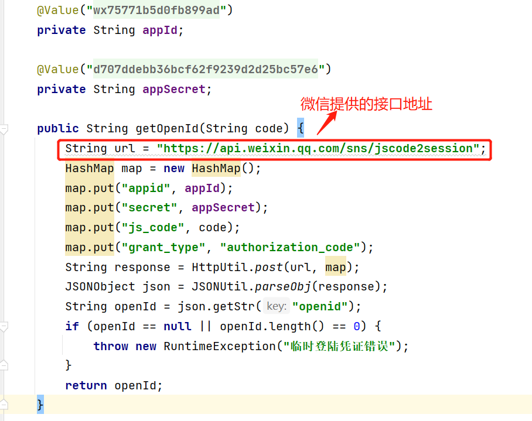
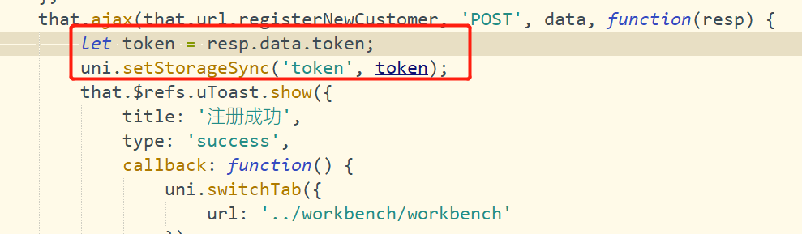
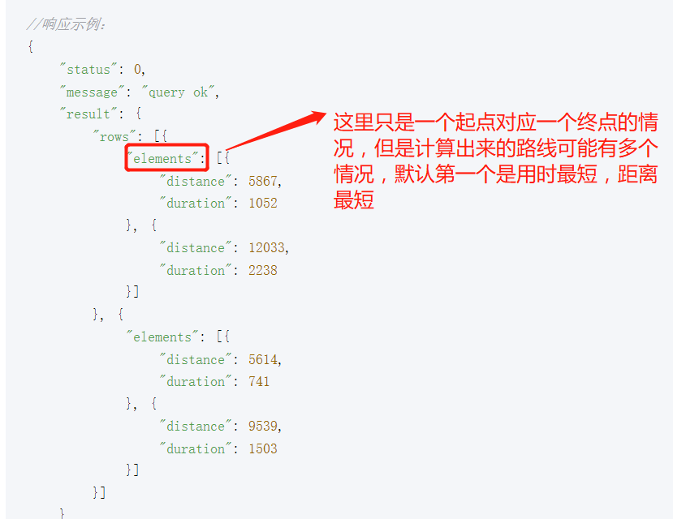
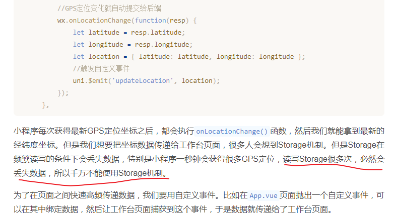
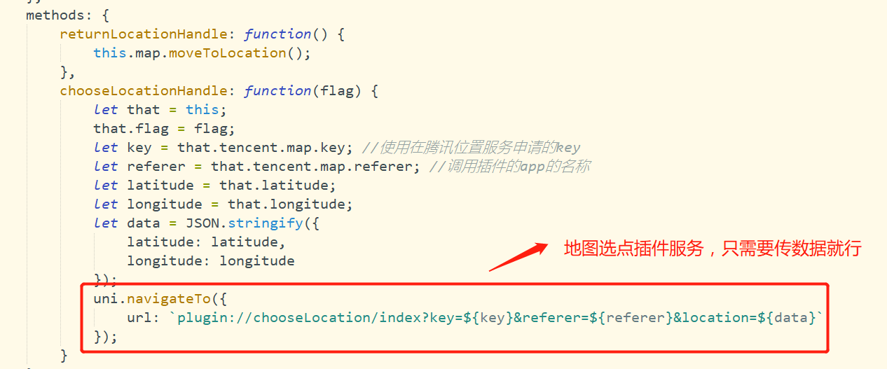
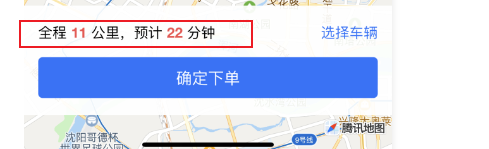
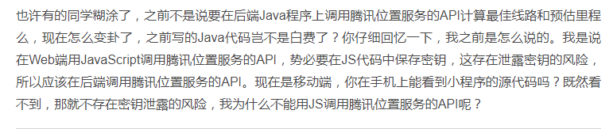
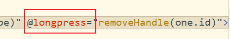
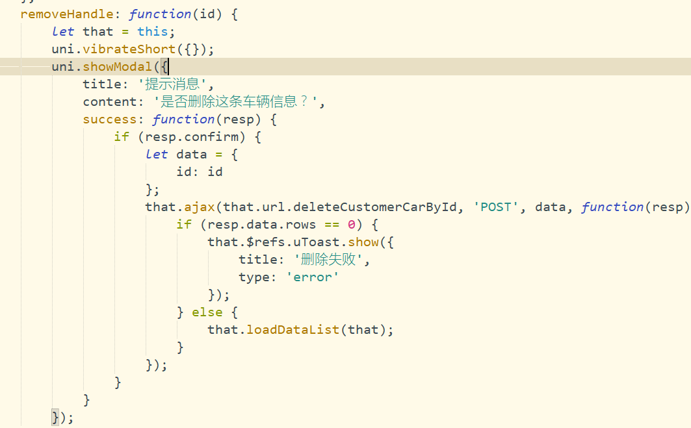

# 后端

## 1.	如何获取微信小程序的openId

```java
//首先在前端登陆页面，当点击登陆的时候，微信会提供一个code，之后通过code与微信公众平台注册的AppId和密钥，发送给微信服务器，微信服务器会解析生成OpenID

```

​	

## 2.	Hutool工具类

### BeanUtil

```
可以使用BeanUtil.beanToMap()  将对象转换为Map
```

### MapUtil

#### 跟直接使用map.get()有何区别？

```
Map<String, Object> map= resultMap;
此时你的泛型中有一个Object ，你不知道Object具体是什么类型，如果Object是int类型的，那么普通的get（key）方法就会报错的
所以要使用MapUtils工具类获取
```

```
isNotEmpty ( ) 是否不为空
isEmpty ( ) 是否为空
putAll ( ) 添加所有元素
getString ( ) 获取String类型的值
getObject ( ) 获取Object类型的值
getInteger ( )获取Integer类型的值
get*** ( ) 类似上面的
EMPTY_MAP 获取一个不可修改的空类型Map
unmodifiableMap 获取一个不可以修改的Map（不能新增或删除）
unmodifiableSortedMap 获取一个不可以修改的有序的Map（不能新增或删除）
fixedSizeMap 获取一个固定长度的map
multiValueMap 获取一个多值的map(即一个key可以对应多个value值)
invertMap 返回一个key与value对调的map
predicatedMap() 返回一个满足predicate条件的map
lazyMap 返回一个lazy的map（值在需要的时候可以创建）
```

## 3.	如何获取Token

#### SaToken权限认证

```java
通过获取雪花算法获取的主键Id
StpUtil.login(id);
StpUtil.getTokenInfo.getTokenValue();

//生成Token最终小程序端获取到，保存到StorageSync里面
```

​	

## 4.	腾讯位置地图服务

https://lbs.qq.com/service/webService/webServiceGuide/webServiceMatrix

地图这里只用到了一个起点到一个终点的位置服务，也就是from[纬度，经度] 	 to[纬度，经度]

**估算里程和时间中的	问题设计？**：那如果要设计一个起点对应多个终点服务的话怎么弄？from[纬度，经度]		 to[纬度，经度;纬度，经度]

​	

**规划行驶路线	问题设计？**：	在估算里程和时间时，我们取的是result中的第一个元素，因为第一个默认代表最短路线和最短时间，但是在规划行驶路线的时候，我们是将result都给统统返回的，因为业务需求，最佳路线不可能只有一条，所以都给返回。

## 5.	页面之间的传参

在APP.VUE	页面定义onLanuch函数，不同于onLoad和onShow函数，该函数只要打开微信小程序就会运行。那么在获取到定位信息的时候怎么将定位信息（经度和纬度）传递给工作台呢？页面之间的传参可以有两种，一种是URL传参，一种是保存在storage里面。两者都不可取。那为什么不用URL传参呢？因为工作台页面是加载出来的，并没有进行页面的跳转，所以是不可取的。

​	

## 6.	刚进入工作台的位置信息是怎么获取的

开启微信小程序的实时定位功能，拿到小程序的最新的经纬度信息，将信息传递给工作台，通过自定义回掉函数，捕获经纬度位置信息，传递给腾讯位置服务，通过将经纬度逆解析得到所在的具体位置信息。显示到所在的工作台页面上面，初始化是经纬度信息提供一个默认值，（天安门）位置，进行坐标预热，因为第一次解析会慢，这样就能避免用户等待。

## 7.	怎么选择终点位置并将其展示在工作台上？

在小程序里面集成了腾讯地图选点插件，会跳转到腾讯地图选点页面。不用额外的去写需求。只需要选择终点位置即可。

​	

## 8.	为什么可以直接在移动端调用API文档显示最短距离和时间

​	

之前不是在后端页面也写过一次吗？

​	

## 9.	关于距离问题

通过腾讯地图位置服务SDK得到的距离要怎么做处理？返回的结果是米。要转换成公里该怎么做？

Math.ceil(ditance/1000*10) / 10

这样强制小数点后面的进位，不能舍弃，因为里程也是算在司机的账单上的，如果舍弃的话司机白干了

## 10.	长按显示弹框

​	

​	

## 11.	小程序的跳转方式

#### 	navigate to 和 redirect to 

​	navigate to 表示可以回退，会返回到某一个页面，有一个回退的箭头，redirect to 表示不可回退，跳转到指定页面

#### 	Onload 和 Onshow

​	Onload表示只加载一次，Onshow表示可以重复的进行页面刷新，比如说当你小程序挂起的时候，再返回到小程序的时候，会重新加载一下刷新一下数据。

## 12.	生成订单

1. 生成订单的时候会由雪花算法随机生成主键值，**跟uuid值**，此时将uuid值插入到订单表里面去，为什么要将uuid插入到订单表里呢？这是后面需要**微信支付的时候用到的**。那么微信支付为什么不用雪花算法生成的主键值呢？因为雪花算法生成的主键值有可能是连续的，用户可能根据当前订单号（也就是主键值）猜到上一个订单信息，会产生危险。所以还要插入一个uuid值

2. 新生成的订单要放在redis里面，并设置好过期时间。为什么要放在redis里面，因为是抢单行为，会出现多个司机去抢同一张票的情况，所以避免数据库的读写压力，会先放到redis里面，为什么要设置过期时间，不设置过期时间的话订单会一直存在，过了很久万一司机抢到了订单，人不在的话岂不是很尴尬。

3. 生成订单之前做的是什么？首先在ServiceImpl中调用两个feign接口，分别是地图子系统，重新规划一下路线，然后是重新估算一下订单金额。之后才在OrderServiceImpl中调用订单子系统，插入订单

   ```
   //重新计算里程和时间，虽然下单前，系统会预估里程和时间，但是有可能顾客在下单页面停留太久，然后在点击下单键，
   // 这时候路线和时长都可能会发生变化，所以需要重新预估里程和时间
   ```

## 13.	定向接单？

1. 定向接单点是怎么表示的？司机会设置一个定位点信息，传入的定位点信息都是火星坐标，经过处理转换成GPS坐标，此时乘客也会有一个终点的坐标，将乘客的终点的坐标也转换成GPS信息，然后计算两者坐标之间的距离。如果距离不超过某一个指定值，即认为他们俩是顺路的。

2. 问题：司机设置定向接单，单独传一个经度纬度？怎么定向呢？

3. 司机实时的定位信息缓存到redis里面，那里面岂不是要缓存好多定位信息？

## 4-13	地图微服务GEO查找附近适合接单司机

## 4-19	Rabbit

Rabbit采用的非阻塞式收发消息，网上的配置都式轮询式的，java程序主动轮询请求Rabbit去查询消息，但是如果移动端没有连接到java程序的话，是收不到消息的。所以采用阻塞式

# 前端

## 1.	小程序保持常亮

		wx.setKeepScreenOn({
			keepScreenOn: true
		});

## 2.	onlaunch？

## 3.	定位信息是要实时上传的？

定位信息不能实时上传，不然服务器压力太大了。解决办法是只在每分钟的前十秒上传定位信息，减少服务器的压力

	// TODO 只在每分钟的前10秒上报定位信息，减小服务器压力
	// let current = new Date();
	// if (current.getSeconds() > 10) {
	// 	return;
	// }

#### 