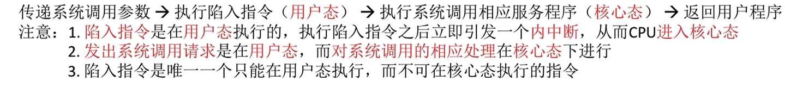
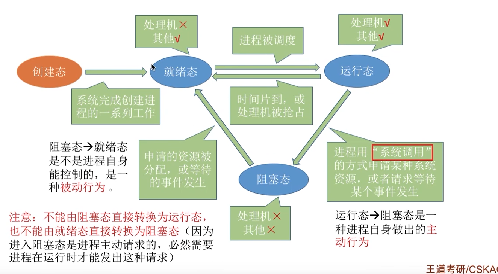

## 四大特征

并发、共享、虚拟、异步

## 系统调用

#### 概念：

操作系统作为计算机硬件和用户之间的接口，需要向上提供一些简单易用的服务。主要包括命令接口和程序借口。其中，程序接口由一组系统调用组成。

#### 过程

## 进程

#### 定义

 

#### 重要知识点

#### 进程状态之间的转换

#### 进程通信

#### 进程调度

#### 调度算法评价指标

#### FCFS、SJF算法

#### 时间片调度轮转算法

#### 优先级调度算法

#### 多级反馈队列调度算法

是对上面几种算法的整合

#### 进程同步与互斥

